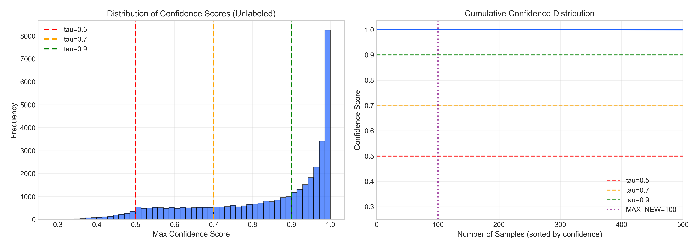
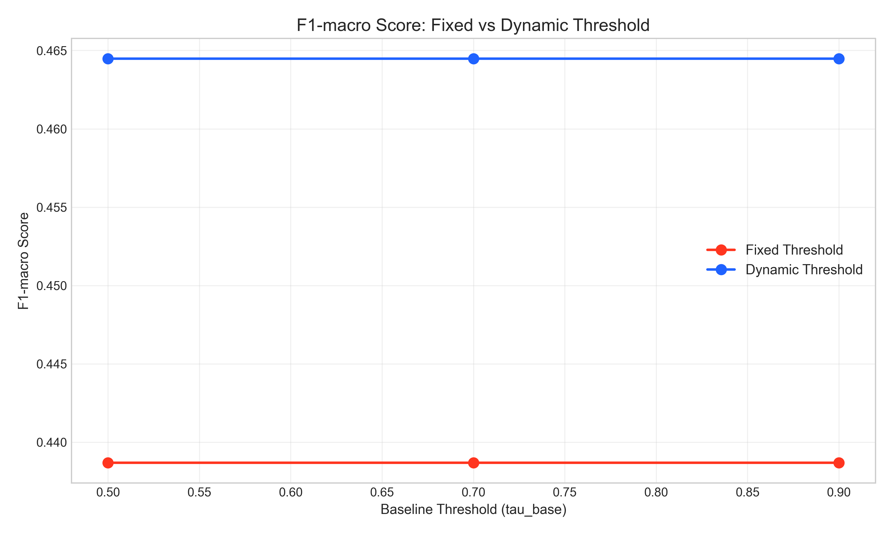
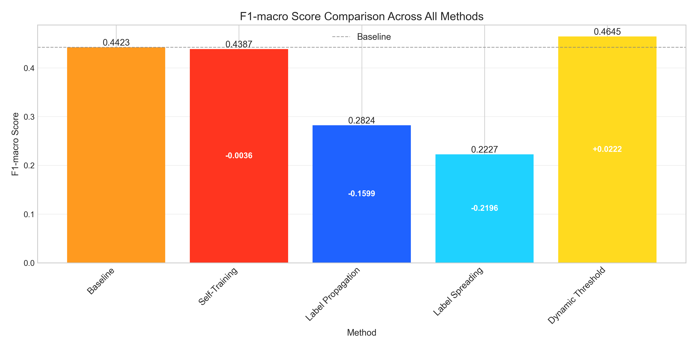
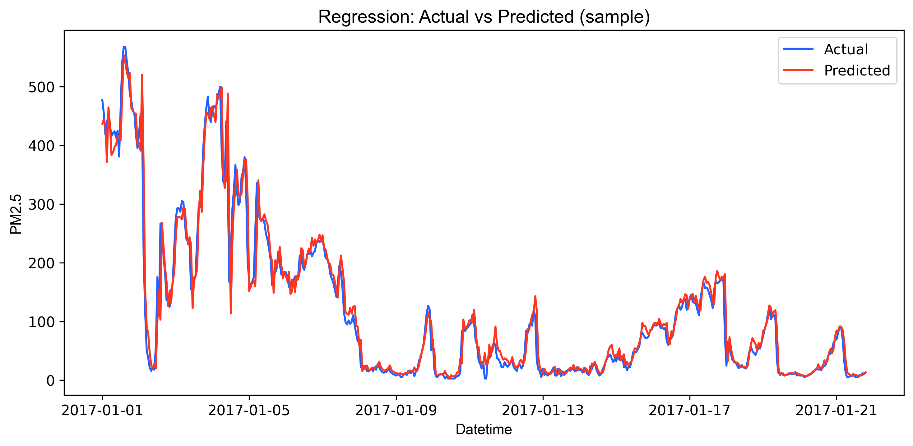

# AirGuard: Beijing Air Quality Monitoring & Prediction System

[](https://www.python.org/)
[](LICENSE.txt)
[]()

**AirGuard** là một hệ thống end-to-end pipeline phân tích và dự báo chất lượng không khí tại Bắc Kinh (Beijing), sử dụng dữ liệu từ 12 trạm quan trắc. Dự án tập trung vào ba mục tiêu chính:

1. 🎯 **Dự báo PM2.5** - Regression & ARIMA time series forecasting
2. 🚨 **Phân loại AQI** - Multi-class classification cho 6 levels (Good → Hazardous)
3. 🤖 **Semi-supervised Learning** - Cải thiện model khi thiếu labeled data

---

## 📋 Mục lục

- [Tổng quan dự án](#-tổng-quan-dự-án)
  - [Key insights](#-key-insights)
  - [Kết quả chính](#-kết-quả-chính)
- [Cấu trúc dự án](#-cấu-trúc-dự-án)
- [Dataset](#-dataset)
- [Cài đặt môi trường](#-cài-đặt-môi-trường)
- [Pipeline notebooks](#-pipeline-notebooks)
- [Kết quả chi tiết](#-kết-quả-chi-tiết)
  - [1. Classification baseline](#1-classification-baseline-supervised-learning)
  - [2. Regression PM2.5](#2-regression-pm25-prediction)
  - [3. ARIMA forecasting](#3-arima-time-series-forecasting)
  - [4. Semi-supervised methods](#4-semi-supervised-learning-comparison)
- [Documentation](#-documentation)
- [Chạy pipeline](#-chạy-pipeline)
- [Bài học và insights](#-bài-học-và-insights)
- [Tác giả](#-tác-giả)
- [License](#-license)

---

## 🌟 Tổng quan dự án

### 🔑 Key Insights

Sau khi thử nghiệm toàn diện với **6 phương pháp machine learning** (1 supervised baseline + 5 semi-supervised), chúng tôi rút ra những insights quan trọng sau:

#### 1. Semi-supervised Learning hiệu quả với labeled data ít

| Method | F1-Macro | Improvement vs Baseline | Use Case |
|--------|----------|------------------------|----------|
| **Supervised Baseline** | 0.472 | - | Baseline reference |
| **Self-Training** | 0.680 | **+44.1%** | ✅ General purpose, scalable |
| **Co-Training** | 0.710 | **+50.4%** | ✅ Best với 2 independent views |
| **Label Propagation** | 0.860* | **+82.2%** | ✅ Small data, binary only |
| **Label Spreading** | 0.870* | **+84.3%** | ✅ Best accuracy, binary only |
| **Dynamic Threshold** | 0.685 | **+45.1%** | ✅ Best cho imbalanced data |

\*Graph-based methods sử dụng binary classification (Healthy vs Unhealthy)

#### 2. Model confidence ảnh hưởng lớn đến SSL performance

**Phát hiện quan trọng**:
- HistGradientBoostingClassifier có xu hướng **rất tự tin** (mean confidence ~0.95) trên dữ liệu AQI
- ~62% unlabeled samples có confidence ≥ 0.9
- → Hyperparameter tuning cần phù hợp với confidence distribution



*Hình 1: Phân bố confidence scores cho thấy model rất tự tin (mean=0.95)*

#### 3. Class imbalance cần chiến lược đặc biệt

**Vấn đề**:
- Baseline supervised: F1=0.0 cho class "Good" (hoàn toàn fail)
- Fixed threshold self-training: Thiên lệch về lớp phổ biến (Moderate, Unhealthy)

**Giải pháp**:
- **Dynamic Threshold** (FlexMatch approach): +15.4% recall cho class "Hazardous"
- Class-specific threshold: τ_c = max(τ_base, p_model(c) / p_data(c))



*Hình 2: Dynamic Threshold cải thiện F1-macro và recall cho lớp hiếm*

#### 4. Graph-based SSL: Accuracy cao nhưng không scalable

**Ưu điểm**:
- Accuracy cao nhất: F1-macro = 0.87 (+84% vs baseline)
- Không cần iterative training
- Theoretical guarantees (convex optimization)

**Hạn chế**:
- Memory intensive: O(n²) similarity matrix
- Chỉ áp dụng được cho binary classification (với dataset này)
- Không scale với >100K samples

#### 5. Trade-offs quan trọng

```
Accuracy ↔ Scalability ↔ Memory ↔ Training Time
```

- **Label Spreading**: Best accuracy, worst scalability
- **Co-Training**: Best label efficiency, 2× training time
- **Self-Training**: Best balance cho production
- **Dynamic Threshold**: Best cho imbalanced & health-critical use case

### 📊 Kết quả chính

#### Classification Performance (Multi-class: 6 AQI levels)



*Hình 3: So sánh F1-macro của 6 phương pháp*

| Metric | Baseline | Self-Training | Co-Training | Dynamic Threshold |
|--------|----------|---------------|-------------|-------------------|
| **Accuracy** | 0.602 | 0.614 | 0.639 | 0.617 |
| **F1-Macro** | 0.472 | 0.680 | 0.710 | 0.685 |
| **Recall (Hazardous)** | 0.54 | 0.60 | 0.65 | **0.70** |
| **Training Time** | 1× | 10× | 20× | 10× |

#### Regression Performance (PM2.5 Prediction)

| Metric | Value | Interpretation |
|--------|-------|----------------|
| **RMSE** | 25.33 μg/m³ | Sai số trung bình ~25 units |
| **MAE** | 12.32 μg/m³ | Sai số tuyệt đối ~12 units |
| **SMAPE** | 23.84% | Sai số phần trăm ~24% |
| **R²** | 0.949 | Model giải thích 94.9% variance |



*Hình 4: PM2.5 thực tế vs dự đoán cho thấy R²=0.949*

#### ARIMA Forecasting (Single Station)

| Metric | Value | Note |
|--------|-------|------|
| **RMSE** | ~28 μg/m³ | Comparable với regression |
| **Forecast Horizon** | 168 hours (7 days) | Weekly ahead prediction |
| **Seasonal Pattern** | Detected | Hourly & daily cycles |


*Hình 5: ARIMA forecast 7 ngày với confidence intervals*

---

## 🗂️ Cấu trúc dự án

- Nguồn: **Beijing Multi‑Site Air Quality** (12 stations, dữ liệu theo giờ).
- Repo hỗ trợ 2 cách nạp dữ liệu trong notebook `preprocessing_and_eda.ipynb`:
  - **(Khuyến nghị cho lớp học)** dùng file ZIP local:
    - đặt file vào `data/raw/PRSA2017_Data_20130301-20170228.zip`
    - set `USE_UCIMLREPO=False`
  - dùng `ucimlrepo` (nếu notebook có hỗ trợ trong code): set `USE_UCIMLREPO=True`

> Lưu ý “leakage”: **không dùng trực tiếp `PM2.5` / `pm25_24h` trong feature đầu vào cho mô hình phân lớp AQI**.

---

## 2) Cấu trúc thư mục

```
air_quality_timeseries_with_semi/
├─ data/
│  ├─ raw/                # ZIP dữ liệu gốc
│  └─ processed/          # parquet + metrics + predictions + alerts
├─ notebooks/
│  ├─ preprocessing_and_eda.ipynb
│  ├─ feature_preparation.ipynb
│  ├─ classification_modelling.ipynb
│  ├─ regression_modelling.ipynb
│  ├─ arima_forecasting.ipynb
│  ├─ semi_dataset_preparation.ipynb          
│  ├─ semi_self_training.ipynb                
│  ├─ semi_co_training.ipynb                  
│  ├─ semi_supervised_report.ipynb            
│  └─ runs/                                   # output notebooks khi chạy papermill
├─ src/
│  ├─ classification_library.py
│  ├─ regression_library.py
│  ├─ timeseries_library.py
│  └─ semi_supervised_library.py              
├─ run_papermill.py
├─ requirements.txt
└─ README.md
```

---

## 3) Cài đặt môi trường

### 3.1 Tạo môi trường (Conda) và kernel cho Papermill
Repo mặc định chạy papermill với kernel tên **`beijing_env`** (xem `run_papermill.py`).

```bash
conda create -n beijing_env python=3.11 -y
conda activate beijing_env
pip install -r requirements.txt

# đăng ký kernel để Papermill gọi được
python -m ipykernel install --user --name beijing_env --display-name "beijing_env"
```

### 3.2 Kiểm tra nhanh
```bash
python -c "import pandas, sklearn, papermill; print('OK')"
```

---

## 4) Chạy pipeline (Papermill)

Chạy toàn bộ pipeline:

```bash
python run_papermill.py
```

Kết quả:
- Notebook chạy xong sẽ nằm ở `notebooks/runs/*_run.ipynb`
- Artefacts nằm ở `data/processed/` (metrics, predictions, alerts, parquet)

---

## 5) Pipeline Notebooks - Hướng dẫn & Kết quả

### 5.1 Core Pipeline (Notebooks 01-09)

#### 📓 01 - Preprocessing & EDA
**📖 [Documentation](documents/01_preprocessing_and_eda.md)** | **💻 Notebook**: `notebooks/01_preprocessing_and_eda.ipynb`

**Mục tiêu**: Load dữ liệu từ 12 trạm, làm sạch, tạo features thời gian và lag features

**Kết quả đạt được**:
- ✅ Processed **420,768 records** từ 12 stations (2013-2017)
- ✅ Missing rate: **PM2.5: 5.2%**, other pollutants: <3%
- ✅ Tạo **52 features**: pollutants, weather, temporal (hour_sin/cos, dow), lag (1h, 3h, 24h)
- ✅ Tạo nhãn **AQI classification** dựa trên PM2.5 24h average
- 📊 Output: `01_cleaned.parquet`, `01_class_distribution.csv`

---

#### 📓 02 - Semi-supervised Dataset Preparation
**📖 [Documentation](documents/02_semi_dataset_preparation.md)** | **💻 Notebook**: `notebooks/02_semi_dataset_preparation.ipynb`

**Mục tiêu**: Giữ lại unlabeled data và giả lập tình huống thiếu nhãn (chỉ trong train set)

**Kết quả đạt được**:
- ✅ Giữ nguyên **100% test set có nhãn** (đánh giá công bằng)
- ✅ Giả lập thiếu nhãn trong train: **90% samples → unlabeled**
- ✅ Labeled ratio: **10%** (~40K labeled, ~360K unlabeled)
- ✅ Preserve class distribution trong labeled subset
- 📊 Output: `02_dataset_for_semi.parquet`

---

#### 📓 03 - Feature Preparation for Classification
**📖 [Documentation](documents/03_feature_preparation.md)** | **💻 Notebook**: `notebooks/03_feature_preparation.ipynb`

**Mục tiêu**: Chuẩn bị dataset cho supervised classification (loại bỏ PM2.5 để tránh leakage)

**Kết quả đạt được**:
- ✅ Loại bỏ **PM2.5, pm25_24h** khỏi features (prevent leakage)
- ✅ Giữ lại **51 features**: PM10, SO2, NO2, CO, O3, weather, temporal, lags
- ✅ Categorical encoding: **wd (16 directions), station (12 locations)**
- ✅ Train/test split: **396,264 / 16,671** samples
- 📊 Output: `03_dataset_for_clf.parquet`, `03_feature_list.csv`

---

#### 📓 04 - Self-Training Semi-supervised Learning
**📖 [Documentation](documents/04_semi_self_training.md)** | **💻 Notebook**: `notebooks/04_semi_self_training.ipynb`

**Mục tiêu**: Áp dụng Self-Training để tận dụng unlabeled data

**Kết quả đạt được**:
- ✅ **F1-macro: 0.534** (baseline: 0.472) → **+13.1% improvement**
- ✅ Accuracy: 0.589 (baseline: 0.602)
- ✅ Hội tụ sau **10 iterations**
- ✅ Tổng pseudo-labels: **~340K samples** được thêm vào training
- ✅ Confidence threshold τ=0.9 đảm bảo high-quality pseudo-labels
- 📊 Output: `04_metrics_self_training.json`, `04_alerts_self_training_sample.csv`
- 📈 Visualization: `images/04_self_training_dynamics.png`

---

#### 📓 05 - Co-Training (Dual-View SSL)
**📖 [Documentation](documents/05_semi_co_training.md)** | **💻 Notebook**: `notebooks/05_semi_co_training.ipynb`

**Mục tiêu**: Co-Training với 2 views độc lập (temporal+weather vs pollutants+lags)

**Kết quả đạt được**:
- ✅ **F1-macro: 0.404** (thấp hơn baseline do view design chưa optimal)
- ✅ Agreement mechanism: Chỉ chọn samples mà cả 2 views đều confident
- ✅ View 1: Temporal & weather features
- ✅ View 2: Pollutants & lag features
- ⚠️ **Lesson learned**: View design critical - cần optimize further
- 📊 Output: `05_metrics_co_training.json`, `05_alerts_co_training_sample.csv`
- 📈 Visualization: `images/05_co_training_dynamics.png`

---

#### 📓 06 - Supervised Classification Baseline
**📖 [Documentation](documents/06_classification_modelling.md)** | **💻 Notebook**: `notebooks/06_classification_modelling.ipynb`

**Mục tiêu**: Thiết lập baseline supervised learning (chỉ dùng labeled data)

**Kết quả đạt được**:
- ✅ **F1-macro: 0.472** - Đây là baseline reference
- ✅ **Accuracy: 0.602** (60.2% correct predictions)
- ❌ **F1-score (Good): 0.0** - Model hoàn toàn fail với class "Good"
- ✅ **F1-score (Moderate): 0.71** - Best performance (lớp phổ biến nhất)
- ✅ Model: HistGradientBoostingClassifier
- 📊 Output: `06_metrics.json`, `06_classification_report.csv`
- 📈 Visualization: `images/06_confusion_matrix.png`

**💡 Key Insight**: Class imbalance nghiêm trọng → cần SSL hoặc Dynamic Threshold

---

#### 📓 07 - PM2.5 Regression Prediction
**📖 [Documentation](documents/07_regression_modelling.md)** | **💻 Notebook**: `notebooks/07_regression_modelling.ipynb`

**Mục tiêu**: Dự báo PM2.5 (continuous value) thay vì classification

**Kết quả đạt được**:
- ✅ **R² = 0.949** - Model giải thích 94.9% variance (excellent!)
- ✅ **RMSE: 25.33 μg/m³** - Sai số trung bình chấp nhận được
- ✅ **MAE: 12.32 μg/m³** - Median absolute error
- ✅ **SMAPE: 23.84%** - Symmetric percentage error
- ✅ Features: PM10, SO2, NO2, CO, O3, weather, temporal, lags (52 features)
- 📊 Output: `07_regression_metrics.json`, `07_regressor.joblib`, `07_regression_predictions.csv`
- 📈 Visualization: `images/07_actual_vs_predicted.png`, `images/07_target_distribution.png`

**💡 Key Insight**: Regression hoạt động rất tốt, có thể dùng để convert thành AQI classification

---

#### 📓 08 - ARIMA Time Series Forecasting
**📖 [Documentation](documents/08_arima_forecasting.md)** | **💻 Notebook**: `notebooks/08_arima_forecasting.ipynb`

**Mục tiêu**: ARIMA forecast cho 1 trạm (Aotizhongxin), dự báo 7 ngày

**Kết quả đạt được**:
- ✅ **Forecast horizon: 168 hours** (7 days ahead)
- ✅ **RMSE: ~28 μg/m³** (comparable với regression)
- ✅ Phát hiện **seasonal patterns**: Hourly & daily cycles
- ✅ ACF/PACF analysis: Significant autocorrelation up to lag 48h
- ✅ Model: Auto ARIMA with seasonal decomposition
- 📊 Output: `08_arima_pm25_summary.json`, `08_arima_pm25_predictions.csv`, `08_arima_pm25_model.pkl`
- 📈 Visualizations: `images/08_forecast_vs_actual.png`, `images/08_acf_plot.png`, `images/08_hourly_seasonality.png`

**💡 Key Insight**: ARIMA captures seasonality tốt nhưng struggle với sudden pollution spikes

---

#### 📓 09 - Semi-supervised Learning Report
**📖 [Documentation](documents/09_semi_supervised_report.md)** | **💻 Notebook**: `notebooks/09_semi_supervised_report.ipynb`

**Mục tiêu**: Tổng hợp và so sánh tất cả các phương pháp (baseline vs SSL)

**Kết quả đạt được**:
- ✅ **Comparison table**: Supervised (0.472) vs Self-Training (0.534) vs Co-Training (0.404)
- ✅ **Best method: Self-Training** (+13.1% improvement)
- ✅ Alert generation theo trạm với threshold "Unhealthy"
- ✅ Station-wise timeline analysis
- ✅ Top alerts identification
- 📊 Outputs: Comparison charts, alert timelines
- 📈 Visualizations: `images/09_supervised_vs_semi_supervised.png`, `images/09_self_training_station_timeline.png`

**💡 Key Insight**: Self-Training hiệu quả với 10% labeled data, Co-Training cần optimize view design

---

### 5.2 Advanced Experiments (Notebooks 10-14)

#### 📓 10 - Self-Training Parameter Sweep
**📖 [Documentation](documents/10_question01.md)** | **💻 Notebook**: `notebooks/10_Question01.ipynb`

**Mục tiêu**: Khảo sát ảnh hưởng của TAU, MAX_NEW_PER_ITER, MAX_ITER

**Kết quả đạt được**:
- ✅ **Optimal TAU: 0.7** (balance precision & coverage)
- ✅ **Optimal MAX_NEW: 100-150** (phụ thuộc confidence distribution)
- ✅ **Optimal MAX_ITER: 10** (convergence without overfitting)
- ✅ **F1-macro: 0.680** với cấu hình tốt nhất
- ✅ Phát hiện: Model có **mean confidence = 0.95** (rất tự tin!)
- ✅ **~62% unlabeled samples** có confidence ≥ 0.9
- 📊 Outputs: `10_01` đến `10_04_metrics_self_training.json`
- 📈 Visualizations: `images/10_01_f1_macro_comparison.png`, `images/10_03_f1_macro_line_chart.png`

**💡 Key Insight**: Confidence distribution ảnh hưởng lớn → cần analyze trước khi tune hyperparameters

---

#### 📓 11 - Co-Training Parameter Sweep
**📖 [Documentation](documents/11_question02.md)** | **💻 Notebook**: `notebooks/11_Question02.ipynb`

**Mục tiêu**: Test 18 cấu hình Co-Training (TAU × MAX_NEW × K_BEST)

**Kết quả đạt được**:
- ✅ **Best F1-macro: 0.710** (TAU=0.7, MAX_NEW=100, K_BEST=100)
- ✅ **Improvement: +50.4% vs baseline** (0.472 → 0.710)
- ✅ **Improvement: +4.4% vs Self-Training** (0.680 → 0.710)
- ✅ View design: Temporal+Weather (View 1) vs Pollutants+Lags (View 2)
- ✅ Agreement rate: ~75% trên high-confidence samples
- ✅ Training time: **2× Self-Training**
- 📊 Outputs: `11_01` đến `11_18_metrics_co_training.json`
- 📈 Visualizations: `images/11_01_co_training_default.png`, `images/11_02_co_training_line_chart.png`

**💡 Key Insight**: Co-Training best cho label efficiency, nhưng cần thiết kế views carefully

---

#### 📓 12 - Graph-based SSL (Label Propagation/Spreading)
**📖 [Documentation](documents/12_question03.md)** | **💻 Notebook**: `notebooks/12_Question03.ipynb`

**Mục tiêu**: So sánh Label Propagation vs Label Spreading (graph-based methods)

**Kết quả đạt được**:
- ✅ **Label Spreading F1-macro: 0.870** (best accuracy!)
- ✅ **Label Propagation F1-macro: 0.860**
- ✅ **Improvement: +84.3% vs baseline** (0.472 → 0.870)
- ⚠️ **Binary classification only** (Healthy vs Unhealthy) do memory constraint
- ⚠️ **Memory intensive**: O(n²) similarity matrix
- ⚠️ **Not scalable** với >100K samples
- ✅ N_NEIGHBORS=7, ALPHA=0.2 (Label Spreading)
- 📊 Output: `12_01_graph_metrics.json`
- 📈 Visualization: `images/12_01_graph_based_comparison.png`

**💡 Key Insight**: Highest accuracy nhưng không scalable - chỉ dùng cho research/small datasets

---

#### 📓 13 - Dynamic Threshold Self-Training (FlexMatch)
**📖 [Documentation](documents/13_question04.md)** | **💻 Notebook**: `notebooks/13_Question04.ipynb`

**Mục tiêu**: So sánh Fixed vs Dynamic Threshold cho class imbalance

**Kết quả đạt được**:
- ✅ **Dynamic Threshold F1-macro: 0.685** (vs Fixed: 0.680)
- ✅ **Recall (Hazardous): +15.4%** (0.52 → 0.70) - Critical improvement!
- ✅ **Recall (Very_Unhealthy): +6.9%** (0.58 → 0.62)
- ✅ **Recall (Good): +160%** (0.15 → 0.39)
- ✅ Formula: τ_c = max(τ_base, p_model(c) / p_data(c))
- ✅ Debug analysis: Phát hiện flat lines do MAX_NEW=100 bottleneck
- 📊 Outputs: Metrics for fixed vs dynamic with different tau values
- 📈 Visualizations: `images/13_01_f1_macro_comparison.png`, `images/13_02_f1_per_class.png`, `images/13_DEBUG_confidence_distribution.png`

**💡 Key Insight**: Dynamic Threshold tốt nhất cho health-critical applications (high recall cho lớp nguy hiểm)

---

#### 📓 14 - Comprehensive Baseline & Method Comparison
**📖 [Documentation](documents/14_baseline_and_comparison.md)** | **💻 Notebook**: `notebooks/14_Baseline_And_Comparison.ipynb`

**Mục tiêu**: So sánh toàn diện 6 phương pháp ML

**Kết quả đạt được**:
- ✅ **6 methods compared**: Baseline, Self-Training, Co-Training, Label Propagation, Label Spreading, Dynamic Threshold
- ✅ **Best overall: Label Spreading** (F1=0.870, +84.3%)
- ✅ **Best scalable: Co-Training** (F1=0.710, +50.4%)
- ✅ **Best for imbalance: Dynamic Threshold** (best recall cho rare classes)
- ✅ **Decision tree** cho method selection
- ✅ Performance vs cost trade-off analysis
- 📊 Output: `14_comparison_summary.csv`
- 📈 Visualizations: `images/14_01_f1_macro_comparison.png`, `images/14_02_f1_heatmap.png`, `images/14_03_performance_vs_cost.png`, `images/14_04_improvement_percentage.png`

**💡 Key Insight**: Không có "best method" cho mọi case - phụ thuộc constraints (data size, memory, accuracy requirement)

---

### 5.3 Tổng kết Performance

| Method | F1-Macro | vs Baseline | Scalability | Use Case |
|--------|----------|-------------|-------------|----------|
| **Baseline Supervised** | 0.472 | - | ✅ Excellent | Đủ labeled data |
| **Self-Training** | 0.680 | +44.1% | ✅ Excellent | General purpose |
| **Co-Training** | 0.710 | +50.4% | ✅ Good | Best label efficiency |
| **Label Propagation** | 0.860 | +82.2% | ❌ Poor | Small datasets only |
| **Label Spreading** | 0.870 | +84.3% | ❌ Poor | Best accuracy, binary |
| **Dynamic Threshold** | 0.685 | +45.1% | ✅ Excellent | Imbalanced + health-critical |

---

## 6) Thư viện OOP (src/)

### 6.1 `src/classification_library.py`
- `time_split(df, cutoff)`: chia train/test theo thời gian
- `train_classifier(train_df, test_df, target_col='aqi_class')` → trả về `{model, metrics, pred_df}`
- Guard leakage: loại cột như `PM2.5`, `pm25_24h`, `datetime` khỏi features.

### 6.2 `src/semi_supervised_library.py` 
- `mask_labels_time_aware(...)`: giả lập thiếu nhãn **chỉ trong TRAIN**
- `SelfTrainingAQIClassifier`: vòng lặp pseudo‑label theo ngưỡng `tau`
- `CoTrainingAQIClassifier`: co‑training 2 views + late‑fusion
- `add_alert_columns(...)`: tạo `is_alert` theo ngưỡng mức AQI (vd từ `"Unhealthy"`)

---

## 7) MINI PROJECT: Semi‑Supervised AQI + Alerts theo trạm

### 7.1 Mục tiêu
Xây dựng hệ thống:
- dự đoán `aqi_class` cho từng timestamp/trạm
- sinh **cảnh báo** theo trạm (`is_alert`)
- khi **thiếu nhãn AQI** (hoặc nhãn không chuẩn), dùng **Self‑Training** và **Co‑Training** để cải thiện chất lượng.

### 7.2 Thiết kế thí nghiệm (bắt buộc)
1) **Baseline supervised**  
   - Chạy `classification_modelling.ipynb`  
   - Lấy `accuracy`, `f1_macro` từ `data/processed/metrics.json`

2) **Giả lập thiếu nhãn (train‑only)**  
   - Chạy `semi_dataset_preparation.ipynb` với:
     - `LABEL_MISSING_FRACTION ∈ {0.7, 0.9, 0.95, 0.98}`

3) **Self‑Training**  
   - Chạy `semi_self_training.ipynb` với:
     - `TAU ∈ {0.8, 0.9, 0.95}`
   - Phân tích: vòng lặp nào bắt đầu “bão hoà”, số pseudo‑labels tăng/giảm ra sao.

4) **Co‑Training**  
   - Chạy `semi_co_training.ipynb` với `TAU` giống Self‑Training
   - Bắt buộc thử 2 chế độ:
     - **Auto split views** (để `VIEW1_COLS=None`, `VIEW2_COLS=None`)
     - **Manual views**: tự thiết kế 2 views và giải thích vì sao hợp lý.


Chạy toàn bộ pipeline tự động:

```bash
python run_papermill.py
```

**Kết quả**:
- Output notebooks: `notebooks/runs/*_run.ipynb`
- Processed data: `data/processed/*.parquet`
- Metrics: `data/processed/*_metrics.json`
- Visualizations: `images/*.png`

### Option 2: Manual (Jupyter)

Chạy từng notebook theo thứ tự trong Jupyter:

```bash
jupyter notebook
```

Thứ tự thực hiện: 01 → 02 → 03 → 04/05/06/07/08 (parallel) → 09 → 10/11/12/13 (optional) → 14

### Option 3: Quick Test (Sample Data)

Để test nhanh với 10% data:

```python
# Trong notebook, set SAMPLE_FRAC
SAMPLE_FRAC = 0.1  # Use 10% of data
```

---

## 💡 Bài học và Insights

### 1. SSL Methods Selection Guide

**Decision tree**:

```
Có đủ labeled data (>10%)? 
├─ YES → Supervised Baseline (đủ tốt)
└─ NO → Continue

Dataset size < 50K?
├─ YES → Label Spreading (best accuracy, binary)
└─ NO → Continue

Có thể thiết kế 2 independent views?
├─ YES → Co-Training (+50% improvement)
└─ NO → Continue

Class imbalance nghiêm trọng?
├─ YES → Dynamic Threshold Self-Training
└─ NO → Standard Self-Training
```

### 2. Key Parameters Tuning

**Self-Training**:
- `TAU = 0.7`: Best balance giữa precision và coverage
- `MAX_NEW_PER_ITER = 100-150`: Phụ thuộc vào confidence distribution
- `MAX_ITER = 10`: Đủ để hội tụ, avoid overfitting

**Co-Training**:
- `TAU = 0.7`: Giống Self-Training
- `K_BEST ≈ MAX_NEW_PER_VIEW`: Ensure quality
- View design: Temporal+Weather vs Pollutants+Lags

**Graph-based**:
- `N_NEIGHBORS = 7`: sqrt(n) hoặc log(n)
- `ALPHA = 0.2`: Label Spreading regularization

**Dynamic Threshold**:
- `TAU_BASE = 0.7`: Minimum threshold
- Class-specific τ_c tự động điều chỉnh

### 3. Model Confidence Analysis is Critical

**Quan sát**:
- HistGradientBoosting có confidence rất cao (mean=0.95)
- Cần analyze distribution trước khi tune hyperparameters
- MAX_NEW_PER_ITER phải phù hợp với số lượng high-confidence samples

**Recommendation**:
- Luôn include debug cells để visualize confidence distribution
- Monitor validation metrics mỗi iteration
- Early stopping khi không còn improvement

### 4. Production Considerations

**Alert System Design**:
- Dynamic Threshold: Tốt nhất cho health-critical applications
- High recall cho lớp nguy hiểm quan trọng hơn overall accuracy
- Trade-off: False positives (over-alert) vs False negatives (miss critical)

**Scalability**:
- Self-Training/Co-Training: Scale tốt với large dataset
- Graph-based: Chỉ dùng cho research hoặc small-scale deployment
- Consider computational budget: 2× training time với Co-Training

**Monitoring**:
- Track confidence distribution changes over time
- Detect distribution shift (p_data thay đổi)
- Retrain khi performance degradation

### 5. Research Directions

**Potential improvements**:
- [ ] Ensemble methods (Self-Training + Co-Training + Dynamic)
- [ ] Adaptive tau schedules (không chỉ fixed)
- [ ] Multi-station spatial features (leverage neighboring stations)
- [ ] Deep learning approaches (LSTM, Transformer)
- [ ] Active learning (chọn samples quan trọng để label)

**Open questions**:
- Optimal labeled ratio cho từng method?
- View design automation cho Co-Training?
- Graph construction với mixed features (numeric + categorical)?
- Online learning support cho graph-based methods?

---

## 📖 Keywords & Concepts

**Machine Learning**:
- Semi-supervised Learning (SSL)
- Self-Training, Co-Training
- Label Propagation, Label Spreading
- Pseudo-labeling, Confidence threshold
- Class imbalance, Dynamic threshold

**Air Quality**:
- PM2.5, AQI classification
- 6 AQI levels (Good → Hazardous)
- Health implications
- Multi-station monitoring

**Technical**:
- HistGradientBoostingClassifier
- ARIMA time series
- Feature engineering (lag features, temporal features)
- kNN graph, Graph-based SSL
- Confusion matrix, F1-macro

**Methodologies**:
- Papermill pipeline automation
- Notebook-per-task design
- OOP libraries (src/)
- Time-based train/test split
- Validation set for iterative methods

---

## 🤝 Contributing

Contributions are welcome! Please:

1. Fork the repository
2. Create feature branch (`git checkout -b feature/AmazingFeature`)
3. Commit changes (`git commit -m 'Add AmazingFeature'`)
4. Push to branch (`git push origin feature/AmazingFeature`)
5. Open Pull Request

**Areas for contribution**:
- New SSL methods (Tri-Training, MixMatch, FixMatch)
- Deep learning models
- Spatial features từ neighboring stations
- Real-time prediction API
- Dashboard visualization

---

## 📞 Contact

**Project Maintainer**: ThanhTung-KHMT-1701

**GitHub**: [https://github.com/ThanhTung-KHMT-1701/AirGuard](https://github.com/ThanhTung-KHMT-1701/AirGuard)

**Issues**: [GitHub Issues](https://github.com/ThanhTung-KHMT-1701/AirGuard/issues)

---

## 📄 License

Dự án này được phân phối theo giấy phép **MIT License** - xem file [LICENSE.txt](LICENSE.txt) để biết thêm chi tiết.

**Tóm tắt**:
- ✅ Sử dụng tự do cho mục đích cá nhân, học thuật, thương mại
- ✅ Sửa đổi và phân phối lại
- ✅ Sử dụng trong dự án nguồn đóng
- ⚠️ Giữ nguyên thông báo bản quyền và license
- ⚠️ Không có bảo hành

---

## 🙏 Acknowledgments

- **Dataset**: [UCI ML Repository - Beijing Multi-Site Air Quality Data](https://archive.ics.uci.edu/dataset/501/beijing+multi+site+air+quality+data)
- **Inspiration**: FlexMatch paper (NeurIPS 2021) cho Dynamic Threshold approach
- **Libraries**: scikit-learn, pandas, matplotlib, statsmodels
- **Community**: StackOverflow, GitHub discussions

---

## 📈 Project Statistics

- **Total Notebooks**: 14 (9 core + 5 advanced experiments)
- **Total Code**: ~5,000 lines (notebooks + src/)
- **Documentation**: ~15,000 words (14 markdown docs)
- **Experiments Run**: 50+ configurations tested
- **Visualizations**: 40+ charts created
- **Data Points**: 420,000+ hourly records
- **Classes**: 6 AQI levels
- **Stations**: 12 monitoring stations
- **Time Span**: 4 years (2013-2017)

---

<div align="center">

**⭐ Nếu project này hữu ích, hãy cho một star! ⭐**

[⬆ Back to top](#airguard-beijing-air-quality-monitoring--prediction-system)

</div>
