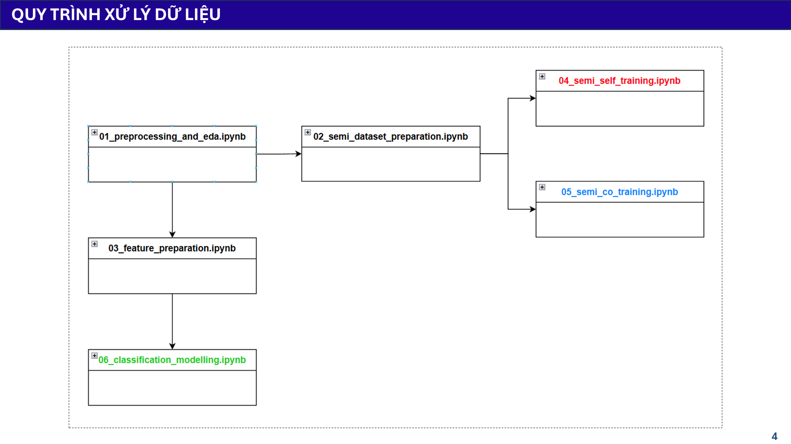
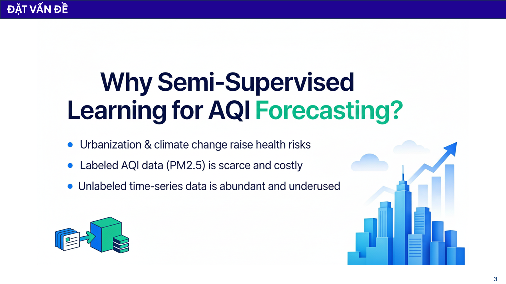
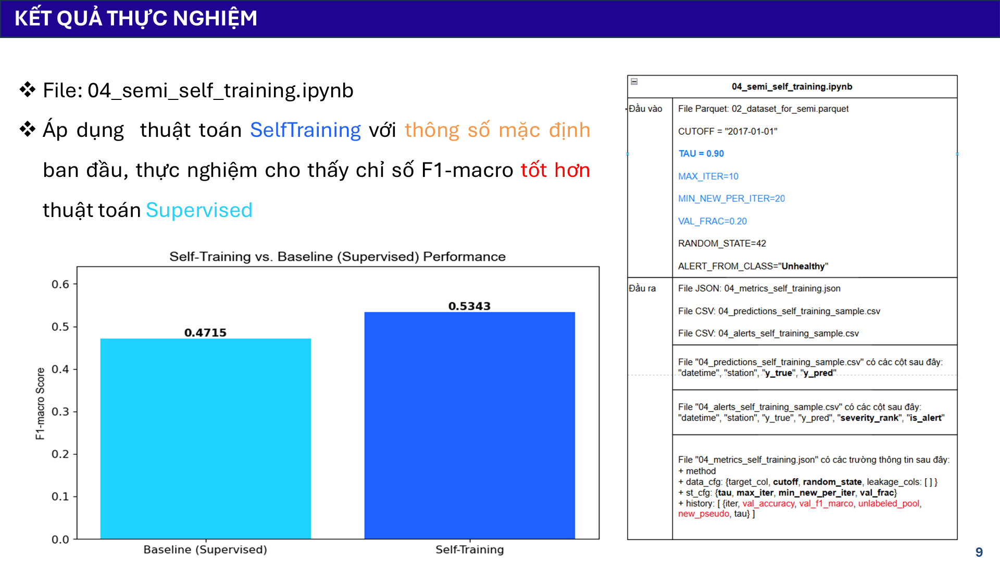
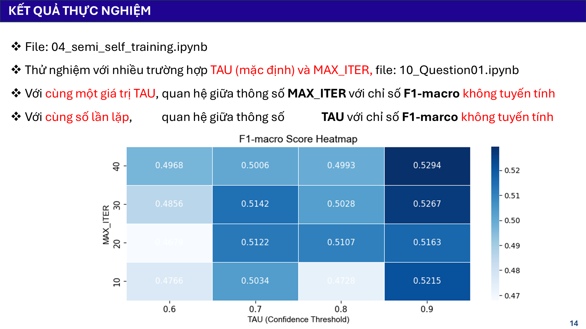
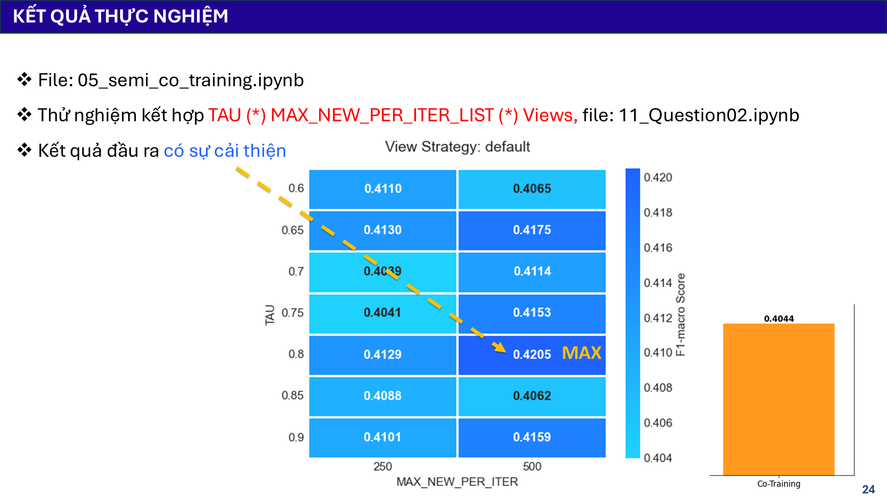
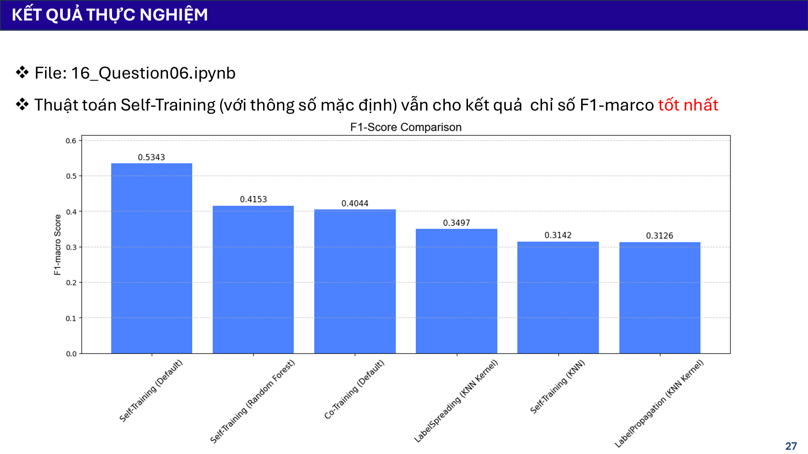

# AirGuard: Phân tích và Dự báo Chất lượng Không khí Bắc Kinh

[](https://www.python.org/)
[](LICENSE.txt)

**AirGuard** là một dự án khoa học dữ liệu end-to-end, thực hiện quy trình phân tích, mô hình hóa và dự báo chất lượng không khí tại Bắc Kinh dựa trên bộ dữ liệu đa trạm từ 2013-2017. Dự án khám phá sâu các kỹ thuật học máy, từ các mô hình có giám sát kinh điển đến các phương pháp học bán giám sát nâng cao, nhằm giải quyết bài toán dự báo trong điều kiện dữ liệu có nhãn hạn chế.

---
## 💻 Công nghệ sử dụng

Dự án được xây dựng trên hệ sinh thái Python với các thư viện khoa học dữ liệu và machine learning hàng đầu:

- **Xử lý dữ liệu**: Pandas, NumPy
- **Trực quan hóa**: Matplotlib, Seaborn
- **Machine Learning**: Scikit-learn (HistGradientBoosting, RandomForest, KNN, Pipelines)
- **Học bán giám sát**: Scikit-learn (LabelPropagation, LabelSpreading) và các thuật toán tự xây dựng.
- **Mô hình chuỗi thời gian**: Statsmodels (ARIMA)
- **Tự động hóa thử nghiệm**: Papermill
- **Ứng dụng Web**: Flask

---

## 🌊 Quy trình xử lý dữ liệu

Toàn bộ pipeline của dự án được thiết kế để đảm bảo tính module hóa, tái sử dụng và logic, từ dữ liệu thô đến kết quả cuối cùng.


*Hình 2: Sơ đồ quy trình xử lý dữ liệu qua các notebooks.*

---

## 🎯 Đặt vấn đề: Tại sao cần Học bán giám sát?


*Hình 1: Lý do lựa chọn phương pháp học bán giám sát.*

Bài toán dự báo chất lượng không khí đối mặt với một thách thức lớn:
- **Dữ liệu được gán nhãn rất khan hiếm và đắt đỏ**: Việc phân loại mức độ AQI một cách chính xác đòi hỏi chuyên môn và thời gian.
- **Dữ liệu không nhãn lại vô cùng dồi dào**: Dữ liệu từ các cảm biến được thu thập liên tục nhưng phần lớn không được gán nhãn.

=> **Học bán giám sát (Semi-Supervised Learning)** là hướng đi chìa khóa để tận dụng nguồn tài nguyên dồi dào này, cải thiện hiệu suất mô hình mà không cần tốn thêm chi phí gán nhãn.

---

## 🔬 Các Câu hỏi Nghiên cứu & Kết quả Nổi bật

Dự án đi sâu vào việc trả lời các câu hỏi nghiên cứu cốt lõi thông qua một loạt các thử nghiệm chi tiết.

### 1. Hiệu quả của Self-Training với chỉ 5% dữ liệu nhãn là như thế nào?

**Kết luận: Rất hiệu quả, vượt xa mô hình baseline.**

Với cấu hình mặc định, **Self-Training** đã chứng tỏ sức mạnh vượt trội, cải thiện chỉ số **F1-macro từ 0.4715 lên 0.5343 (+13.3%)** so với mô hình Supervised baseline. Đây là phương pháp cho kết quả tốt nhất trong tất cả các thử nghiệm.


*Hình 2: Self-Training cho F1-macro cao hơn đáng kể so với baseline.*

> [▶ Xem tài liệu](./documents/04_semi_self_training.md) | [▶ Xem notebook](./notebooks/04_semi_self_training.ipynb)

### 2. Các tham số `TAU` và `MAX_ITER` ảnh hưởng đến Self-Training ra sao?

**Kết luận: `TAU` (ngưỡng tin cậy) là quan trọng nhất, và cấu hình mặc định ban đầu đã là tốt nhất.**

Thử nghiệm sâu trên 16 tổ hợp tham số cho thấy:
-   Hiệu suất không có mối quan hệ tuyến tính với `TAU` và `MAX_ITER`.
-   Cấu hình ban đầu (`TAU=0.9`, `MAX_ITER=10`) đã cho ra **F1-macro cao nhất (0.5294)**, cho thấy việc tinh chỉnh thêm không mang lại nhiều lợi ích.


*Hình 3: Heatmap cho thấy F1-macro cao nhất nằm ở góc trên bên phải, tương ứng với cấu hình mặc định.*

> [▶ Xem tài liệu](./documents/10_question01.md) | [▶ Xem notebook](./notebooks/10_Question01.ipynb)

### 3. Phương pháp "Dynamic Threshold" có cải thiện được việc dự báo lớp hiếm không?

**Kết luận: Có, nhưng phải đánh đổi bằng F1-macro tổng thể.**

Thử nghiệm với Dynamic Threshold (lấy cảm hứng từ FlexMatch) cho một kết quả thú vị:
-   **F1-macro tổng thể bị giảm** so với việc dùng ngưỡng cố định (Fixed Threshold).
-   Tuy nhiên, phương pháp này lại giúp **tăng chỉ số Recall cho các lớp cực kỳ hiếm** như `Hazardous` **lên tới +15.4%**.

Đây là một sự đánh đổi quan trọng: chấp nhận giảm một chút hiệu suất tổng thể để tăng khả năng "phát hiện" các trường hợp nguy hiểm nhất.


*Hình 4: Dynamic Threshold (màu xanh) cho F1-macro thấp hơn Fixed Threshold (màu đỏ).

> [▶ Xem tài liệu](./documents/13_question04.md) | [▶ Xem notebook](./notebooks/13_Question04.ipynb)

### 4. Co-Training có thể được cải thiện không?

**Kết luận: Có, nhưng không đáng kể và vẫn thua xa Self-Training.**

Mô hình Co-Training mặc định ban đầu cho kết quả rất thấp (F1-macro = 0.4044) do overfitting. Tuy nhiên, qua quá trình thử nghiệm sâu với các chiến lược chia "view" và tham số `TAU`, `MAX_NEW_PER_ITER`, chúng tôi đã tìm ra cấu hình tốt hơn, giúp **cải thiện F1-macro lên 0.4205**. Mặc dù có sự cải thiện, kết quả này vẫn thấp hơn đáng kể so với Self-Training.


*Hình 5: Heatmap cho thấy F1-macro của Co-Training được cải thiện khi tinh chỉnh tham số, đạt MAX ở 0.4205.*

> [▶ Xem tài liệu](./documents/11_question02.md) | [▶ Xem notebook](./notebooks/11_Question02.ipynb)

### 5. So sánh tổng thể các phương pháp Bán giám sát?

**Kết luận: Self-Training với cấu hình mặc định vẫn là "nhà vô địch".**

Sau khi so sánh tất cả các phương pháp, bao gồm cả các biến thể của Self-Training (dùng RandomForest, KNN) và các thuật toán dựa trên đồ thị, `Self-Training (Default)` vẫn cho kết quả **F1-macro cao nhất** với thời gian thực thi hợp lý.


*Hình 6: Self-Training (Default) đứng đầu trong bảng so sánh F1-score.*

> [▶ Xem tài liệu so sánh](./documents/09_semi_supervised_report.md) | [▶ Xem notebook thử nghiệm](./notebooks/16_Question06.ipynb)

---

## 📂 Cấu trúc thư mục

Để dễ dàng điều hướng và tìm kiếm thông tin, dự án được tổ chức theo cấu trúc sau:

```
.
├── 📁 data/
│   ├── 📄 processed/   # Dữ liệu đã xử lý, kết quả từ notebooks (CSV, JSON)
│   └── 📄 raw/         # Dữ liệu thô ban đầu
├── 📁 documents/       # Các file Markdown giải thích chi tiết cho từng notebook
├── 📁 images/          # Toàn bộ hình ảnh, biểu đồ được tạo ra và sử dụng
├── 📁 notebooks/       # Các Jupyter Notebooks thực hiện pipeline
├── 📁 src/             # Mã nguồn Python cho các thư viện, module chung
├── 📁 templates/       # Giao diện HTML cho Web App
├── 🐍 AirGuard_WebApp.py # File chạy ứng dụng web Flask
├── 📜 requirements.txt # Danh sách các thư viện cần thiết
└── README.md          # File bạn đang đọc
```

---

## 🛠️ Hướng dẫn sử dụng

Dưới đây là các cách khác nhau để bạn có thể khám phá và sử dụng dự án này, tùy thuộc vào mục tiêu của bạn.

### 1. Xem nhanh kết quả và phân tích (Không cần chạy code)

Cách nhanh nhất để hiểu về dự án là đọc các tài liệu đã được tổng hợp sẵn:
-   **Đọc `README.md`**: File này đã tóm tắt những câu hỏi nghiên cứu và kết quả nổi bật nhất.
-   **Xem tài liệu chi tiết**: Thư mục `documents/` chứa các file `.md` giải thích sâu hơn về quy trình và kết quả của từng notebook.
-   **Khám phá biểu đồ**: Toàn bộ các biểu đồ, hình ảnh trực quan hóa đều được lưu trong thư mục `images/`.

### 2. Trải nghiệm tương tác qua Web App

Dự án có một ứng dụng web đơn giản để bạn có thể xem các kết quả một cách trực quan.

**Các bước thực hiện:**

1.  **Cài đặt**: Đảm bảo bạn đã hoàn thành các bước cài đặt ở mục dưới.
2.  **Khởi chạy Server**: Mở terminal trong thư mục gốc của dự án và chạy lệnh:
    ```bash
    python AirGuard_WebApp.py
    ```
3.  **Truy cập ứng dụng**: Mở trình duyệt web và truy cập vào địa chỉ `http://127.0.0.1:5000`. Bạn sẽ thấy giao diện chính, từ đó có thể điều hướng đến từng trang để xem kết quả chi tiết của mỗi notebook.

### 3. Tái tạo lại kết quả (Dành cho nhà phát triển)

Nếu bạn muốn tự mình chạy lại toàn bộ quy trình để kiểm chứng hoặc phát triển thêm, hãy làm theo các bước sau:

#### a. Cài đặt môi trường

1.  **Clone a copy of the repo**:
    ```bash
    git clone https://github.com/ThanhTung-KHMT-1701/AirGuard.git
    ```
2.  **Tạo môi trường ảo và cài đặt thư viện**:
    ```bash
    cd AirGuard
    python -m venv venv
    venv\Scripts\activate
    pip install -r requirements.txt
    ```

#### b. Chạy các Notebooks

Mở thư mục dự án bằng Jupyter Notebook hoặc VS Code. Chạy các file trong thư mục `notebooks/` theo thứ tự từ `01` đến `16` để tái tạo lại toàn bộ kết quả phân tích và thử nghiệm.

---

## 📄 Giấy phép

Dự án này được cấp phép theo Giấy phép MIT. Xem chi tiết tại tệp [LICENSE.txt](LICENSE.txt).
