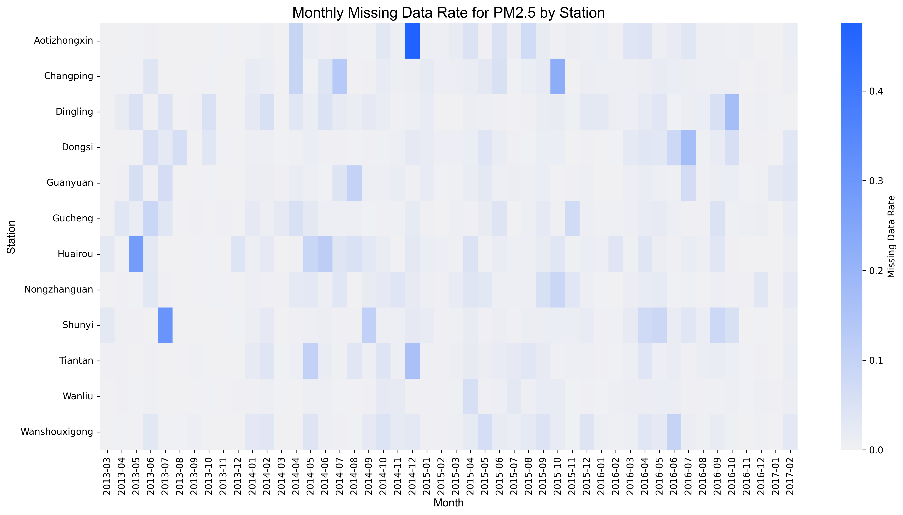
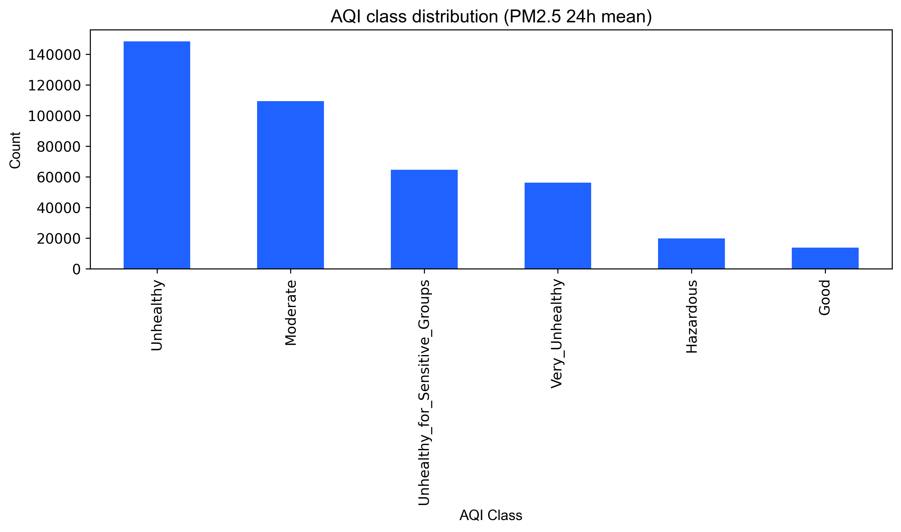

# Tài liệu: 01 - Tiền xử lý và Phân tích dữ liệu khám phá (EDA)

## 🎯 Mục tiêu

Notebook này là bước đầu tiên trong pipeline, thực hiện hai nhiệm vụ chính:
1.  **Tiền xử lý dữ liệu**: Làm sạch bộ dữ liệu về chất lượng không khí tại Bắc Kinh, bao gồm việc hợp nhất dữ liệu từ 12 trạm, xử lý các giá trị bị thiếu và chuẩn hóa cấu trúc.
2.  **Phân tích dữ liệu khám phá (EDA)**: Trích xuất các thông tin quan trọng từ dữ liệu thô thông qua các phương pháp thống kê và trực quan hóa, nhằm hiểu rõ hơn về đặc điểm của dữ liệu.

---

## 📊 Quy trình và Kết quả phân tích

### 1. Hợp nhất và làm sạch dữ liệu

- **Dữ liệu đầu vào**: 12 tệp CSV riêng lẻ, mỗi tệp tương ứng với một trạm quan trắc.
- **Hành động**:
    - Hợp nhất tất cả các tệp thành một DataFrame duy nhất.
    - Chuyển đổi cột thời gian sang định dạng `datetime`.
    - Phân tích tỷ lệ dữ liệu bị thiếu.
- **Kết quả**:
    - Tỷ lệ dữ liệu bị thiếu cao nhất tập trung ở các cột `PM2.5` (~10%) và `PM10`.
    - Các cột khác có tỷ lệ thiếu thấp hơn đáng kể.


*Hình 1: Biểu đồ nhiệt thể hiện tỷ lệ dữ liệu bị thiếu. Các vùng sáng hơn cho thấy tỷ lệ thiếu cao hơn.*

### 2. Xử lý giá trị thiếu (Imputation)

- **Phương pháp**: Sử dụng phương pháp **nội suy tuyến tính theo thời gian (Time-based Linear Interpolation)** để điền vào các giá trị bị thiếu.
- **Lý do lựa chọn**: Dữ liệu chất lượng không khí là dạng chuỗi thời gian, giá trị tại một thời điểm thường có liên quan mật thiết đến các giá trị liền kề. Nội suy tuyến tính giúp bảo toàn xu hướng tự nhiên của dữ liệu mà không làm sai lệch các đặc tính thống kê.

### 3. Kỹ thuật đặc trưng (Feature Engineering)

- **Tạo nhãn AQI**:
    - Tính toán giá trị **PM2.5 trung bình trượt 24 giờ**.
    - Dựa trên giá trị trung bình này, gán nhãn phân loại chất lượng không khí (AQI) theo 6 cấp độ tiêu chuẩn của US EPA (Tốt, Trung bình, Không lành mạnh cho nhóm nhạy cảm, Không lành mạnh, Rất không lành mạnh, Nguy hiểm).
- **Tạo đặc trưng thời gian**: Trích xuất các thông tin thời gian như giờ trong ngày, ngày trong tuần, tháng, năm để phát hiện các xu hướng theo mùa hoặc theo chu kỳ.
- **Tạo đặc trưng trễ (Lag Features)**: Tạo ra các cột dữ liệu mới chứa giá trị `PM2.5` tại các thời điểm trước đó (ví dụ: 1 giờ trước, 3 giờ trước, 24 giờ trước). Các đặc trưng này rất quan trọng cho các mô hình dự báo chuỗi thời gian.

### 4. Phân tích phân phối lớp AQI

- **Kết quả**: Phân tích biểu đồ phân phối cho thấy sự **mất cân bằng dữ liệu** nghiêm trọng.
    - Các lớp `Moderate` và `Unhealthy for Sensitive Groups` chiếm phần lớn số lượng mẫu.
    - Các lớp `Good` và `Hazardous` là các lớp thiểu số, xuất hiện rất ít.
- **Hệ quả**: Sự mất cân bằng này là một thách thức lớn đối với các mô hình phân loại. Mô hình có thể sẽ dự đoán tốt các lớp đa số nhưng lại hoạt động kém hiệu quả trên các lớp thiểu số, vốn thường là các lớp quan trọng cần được cảnh báo (ví dụ: `Hazardous`).


*Hình 2: Biểu đồ cột thể hiện sự phân bố không đồng đều của các mẫu trong mỗi lớp AQI.*

---

## 💾 Kết quả đầu ra

| Tệp                                         | Mô tả                                                                   |
| ------------------------------------------- | ----------------------------------------------------------------------- |
| `data/processed/01_cleaned.parquet`         | **Dataset chính**: Đã được làm sạch, xử lý giá trị thiếu và bổ sung các đặc trưng mới. |
| `data/processed/01_missing_rate.csv`        | Bảng thống kê tỷ lệ phần trăm dữ liệu bị thiếu cho từng cột.             |
| `data/processed/01_class_distribution.csv`  | Bảng thống kê số lượng mẫu cho từng lớp AQI.                             |

---

## 🔑 Kết luận và Bước tiếp theo

- Quá trình tiền xử lý đã tạo ra một bộ dữ liệu sạch và giàu thông tin, sẵn sàng cho các bước mô hình hóa.
- Phân tích EDA đã chỉ ra thách thức chính là sự mất cân bằng dữ liệu, cần được giải quyết ở các giai đoạn tiếp theo, đặc biệt là trong các bài toán phân loại và học bán giám sát.
| **Unhealthy**                      | 55.5 – 125.4  | Không tốt cho sức khỏe                                                | 🔴 Đỏ      |
| **Very_Unhealthy**                 | 125.5 – 225.4 | Rất không tốt cho sức khỏe                                            | 🟣 Tím     |
| **Hazardous**                      | > 225.4       | Nguy hại - Cảnh báo khẩn cấp                                          | 🟤 Nâu đỏ  |

**Hình minh họa:**


**Mã nguồn tham khảo:** [src/classification_library.py](../src/classification_library.py) - hàm `pm25_to_aqi_class()`

```python
# PM2.5 breakpoints (µg/m³)
bins = [-np.inf, 9.0, 35.4, 55.4, 125.4, 225.4, np.inf]
AQI_CLASSES = ["Good", "Moderate", "Unhealthy_for_Sensitive_Groups", 
               "Unhealthy", "Very_Unhealthy", "Hazardous"]
```

---

## 💡 Ý nghĩa trong dự án

Notebook này là **bước đầu tiên và quan trọng nhất** trong pipeline xử lý dữ liệu:

- **Output `01_cleaned.parquet`** là đầu vào cho tất cả các notebooks tiếp theo
- **Nhãn `aqi_class`** được sử dụng cho các bài toán Classification và Semi-supervised Learning
- **Lag features** được sử dụng cho các bài toán Time Series và Regression

---

## 🔗 Notebooks liên quan

- **Tiếp theo:** [02_semi_dataset_preparation.md](02_semi_dataset_preparation.md) - Chuẩn bị dữ liệu cho Semi-supervised Learning
