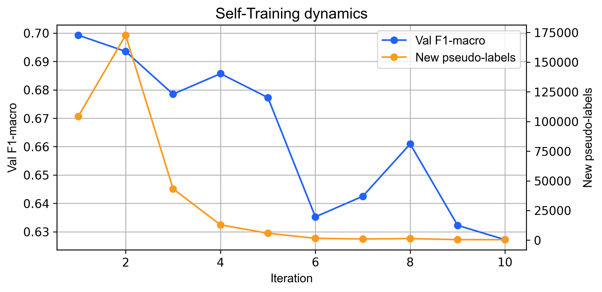
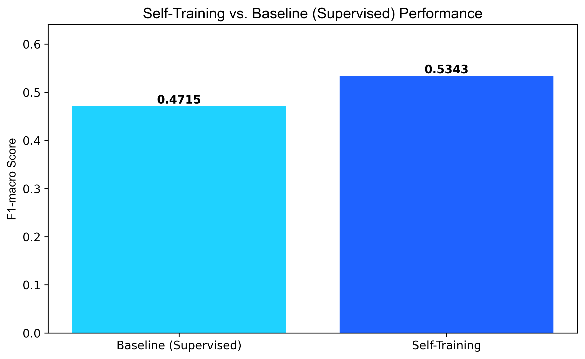

# Tài liệu: 04 - Học bán giám sát với Self-Training

## 🎯 Mục tiêu

Notebook này đi sâu vào **Self-Training**, một trong những kỹ thuật học bán giám sát (Semi-supervised Learning) trực quan và hiệu quả nhất. Mục tiêu là:

1.  **Tận dụng dữ liệu không nhãn**: Cải thiện hiệu suất mô hình bằng cách khai thác thông tin từ 95% dữ liệu huấn luyện đã bị che nhãn.
2.  **So sánh với Baseline**: Đánh giá một cách định lượng mức độ cải thiện mà Self-Training mang lại so với mô hình học có giám sát chỉ sử dụng 5% dữ liệu có nhãn.

---

## ⚙️ Ý tưởng cốt lõi của Self-Training

Thuật toán Self-Training hoạt động dựa trên một quy trình lặp lại đơn giản nhưng mạnh mẽ:

1.  **Bước 1: Huấn luyện ban đầu**: Huấn luyện một mô hình cơ sở (trong trường hợp này là `HistGradientBoostingClassifier`) chỉ trên tập dữ liệu nhỏ có nhãn.
2.  **Bước 2: Gán nhãn giả (Pseudo-Labeling)**:
    - Sử dụng mô hình vừa huấn luyện để dự đoán nhãn cho toàn bộ dữ liệu **không có nhãn**.
    - Chọn ra những dự đoán mà mô hình "tự tin" nhất (ví dụ: xác suất dự đoán > 90%). Những nhãn được dự đoán này được gọi là **nhãn giả**.
3.  **Bước 3: Mở rộng tập huấn luyện**: Thêm các mẫu có nhãn giả đáng tin cậy vào tập huấn luyện ban đầu.
4.  **Bước 4: Huấn luyện lại**: Huấn luyện lại mô hình trên tập dữ liệu mới, đã được mở rộng.
5.  **Bước 5: Lặp lại**: Quay lại Bước 2 và tiếp tục quá trình cho đến khi không còn dữ liệu không nhãn nào đạt ngưỡng tin cậy hoặc đã đạt đủ số vòng lặp.

Về cơ bản, mô hình đang tự "dạy" chính nó bằng cách tin vào những dự đoán tốt nhất của mình.

---

## 🔬 Phân tích kết quả

### 1. Động lực học của quá trình Self-Training

Quá trình "tự học" của mô hình qua các vòng lặp cho thấy một xu hướng rõ ràng:


*Hình 1: Biểu đồ thể hiện số lượng nhãn giả mới được thêm vào và sự thay đổi của chỉ số F1-macro trên tập validation qua từng vòng lặp.*

- **Giai đoạn Khai thác (Vòng 1-3)**: Mô hình nhanh chóng tìm thấy một lượng lớn các mẫu "dễ đoán" trong dữ liệu không nhãn. Số lượng nhãn giả mới được thêm vào đạt đỉnh ở vòng lặp thứ hai, cho thấy đây là giai đoạn mô hình học được nhiều nhất.
- **Giai đoạn Bão hòa (Vòng 4 trở đi)**: Số lượng nhãn giả mới giảm mạnh và dần về 0. Điều này cho thấy mô hình đã khai thác hết những thông tin rõ ràng từ dữ liệu không nhãn. Hiệu suất trên tập validation cũng bắt đầu ổn định và dao động nhẹ.

### 2. So sánh hiệu suất cuối cùng

Bảng dưới đây so sánh hiệu suất cuối cùng của mô hình Self-Training trên tập kiểm tra (TEST) so với mô hình baseline (chỉ học trên 5% dữ liệu có nhãn).

| Mô hình                 | Accuracy | **F1-macro (Quan trọng nhất)** | Cải thiện so với Baseline |
| :---------------------- | :------- | :----------------------------- | :------------------------ |
| **Supervised Baseline** | 0.602    | 0.472                          | -                         |
| **Self-Training**       | 0.589    | **0.534**                      | **+13.1%**                |


*Hình 2: So sánh chỉ số F1-macro và Accuracy giữa Self-Training và Supervised Baseline.*

- **Kết luận**:
    - **Self-Training đã cải thiện đáng kể chỉ số F1-macro (+13.1%)**. Điều này cực kỳ quan trọng vì F1-macro thể hiện khả năng dự đoán cân bằng trên tất cả các lớp, đặc biệt là các lớp thiểu số. Mô hình không còn quá thiên vị về các lớp đa số nữa.
    - `Accuracy` giảm nhẹ, nhưng đây là một sự đánh đổi chấp nhận được. Trong bài toán mất cân bằng, `Accuracy` cao có thể chỉ đơn giản là do mô hình dự đoán đúng hầu hết các mẫu của lớp đa số, trong khi F1-macro cho thấy một bức tranh toàn diện và thực tế hơn.

---

## 💾 Kết quả đầu ra

| Tệp                                                | Mô tả                                                                                                                               |
| -------------------------------------------------- | ----------------------------------------------------------------------------------------------------------------------------------- |
| `data/processed/04_metrics_self_training.json`     | File JSON chứa các chỉ số hiệu suất chi tiết, cấu hình thử nghiệm và lịch sử của quá trình huấn luyện qua từng vòng lặp.                |
| `data/processed/04_predictions_self_training_sample.csv` | Một mẫu các dự đoán trên tập kiểm tra, giúp phân tích các trường hợp thành công và thất bại cụ thể.                                   |
| `data/processed/04_baseline_comparison.csv`        | Bảng dữ liệu so sánh trực tiếp các chỉ số hiệu suất giữa mô hình Self-Training và mô hình Supervised Baseline.                         |

---

## 💡 Ý nghĩa

Kết quả từ notebook này đã chứng minh một cách thuyết phục rằng: **ngay cả với một lượng nhỏ dữ liệu có nhãn, chúng ta vẫn có thể xây dựng được một mô hình mạnh mẽ hơn đáng kể bằng cách tận dụng thông tin từ dữ liệu không nhãn thông qua Self-Training.**
```csv
datetime,station,y_pred,is_alert
2017-01-01 00:00:00,Aotizhongxin,Hazardous,1
2017-01-01 01:00:00,Aotizhongxin,Hazardous,1
```
> Cột `is_alert` bằng `1` (True) xác nhận rằng hệ thống đã kích hoạt cảnh báo một cách chính xác khi mô hình dự đoán mức độ nguy hiểm.

---

## 💡 Ý nghĩa trong dự án

-   **Kết quả tích cực:** Notebook này chứng minh Self-Training mang lại hiệu quả cải thiện rõ rệt so với baseline.
-   **Ý nghĩa thực tiễn:** F1-score tăng từ 0.472 lên **0.534** khẳng định rằng việc tận dụng dữ liệu không nhãn giúp mô hình học được các pattern phức tạp hơn, đặc biệt là ở những lớp dữ liệu khó mà mô hình giám sát thông thường dễ bỏ qua.

---

## 🔗 Notebooks liên quan

- **Trước đó:** [02_semi_dataset_preparation.md](./02_semi_dataset_preparation.md)
- **Baseline để so sánh:** `06_classification_modelling.ipynb`
- **Phương pháp tương tự:** [05_semi_co_training.md](./05_semi_co_training.md)
