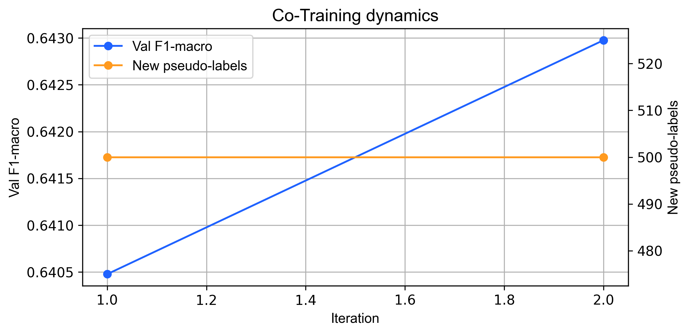
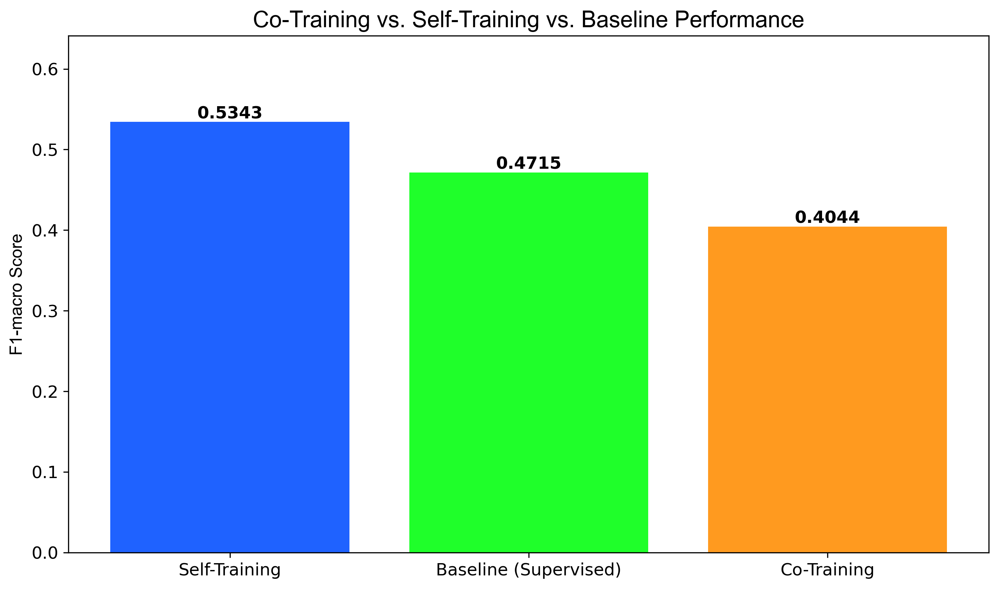

# Tài liệu: 05 - Học bán giám sát với Co-Training

## 🎯 Mục tiêu

Notebook này khám phá **Co-Training**, một phương pháp học bán giám sát nâng cao hơn so với Self-Training. Mục tiêu là:

1.  **Tận dụng "Đa góc nhìn" (Multi-view)**: Huấn luyện hai mô hình riêng biệt trên hai tập con đặc trưng (views) khác nhau của dữ liệu.
2.  **Thúc đẩy học hỏi lẫn nhau**: Tạo ra một cơ chế để hai mô hình "dạy" cho nhau, trao đổi những kiến thức mà chúng tự tin nhất.
3.  **Đánh giá và So sánh**: So sánh hiệu quả của Co-Training với Self-Training và baseline để xác định cách tiếp cận tối ưu nhất.

---

## ⚙️ Ý tưởng cốt lõi của Co-Training

Co-Training hoạt động dựa trên giả định rằng bộ đặc trưng của chúng ta có thể được phân chia thành hai tập con (gọi là **views**) độc lập một cách tự nhiên. Mỗi view phải đủ thông tin để có thể tự mình huấn luyện một mô hình tốt.

Quy trình hoạt động như sau:
1.  **Bước 1: Phân chia Views**: Chia bộ đặc trưng thành hai views. Trong dự án này, chúng tôi chia thành:
    *   **View 1 (Đặc trưng Cảm biến & Trễ)**: Gồm các giá trị đo lường trực tiếp từ cảm biến (`PM10`, `SO2`, `NO2`, ...) và các giá trị trễ (`PM2.5_lag_1h`, ...).
    *   **View 2 (Đặc trưng Ngữ cảnh & Thời gian)**: Gồm các thông tin về bối cảnh như `station`, hướng gió (`wd`), và các đặc trưng thời gian (`hour`, `month`, ...).
2.  **Bước 2: Huấn luyện ban đầu**: Huấn luyện hai mô hình riêng biệt (`Classifier 1` và `Classifier 2`), mỗi mô hình chỉ được "nhìn thấy" một view của dữ liệu có nhãn.
3.  **Bước 3: Trao đổi kiến thức (Lặp lại)**:
    *   Cả hai mô hình dự đoán trên dữ liệu không nhãn.
    *   `Classifier 1` chọn ra những dự đoán mà nó tự tin nhất và "dạy" cho `Classifier 2` bằng cách cung cấp các nhãn giả này.
    *   Ngược lại, `Classifier 2` cũng làm điều tương tự cho `Classifier 1`.
4.  **Bước 4: Huấn luyện lại**: Cả hai mô hình được huấn luyện lại trên tập dữ liệu có nhãn đã được mở rộng nhờ các nhãn giả từ mô hình còn lại. Quá trình này lặp lại nhiều lần.

---

## 🔬 Phân tích kết quả

### 1. Động lực học của quá trình Co-Training


*Hình 1: Quá trình học của Co-Training diễn ra ổn định do số lượng nhãn giả mới được thêm vào mỗi vòng lặp bị giới hạn ở mức 500.*

Không giống như Self-Training có sự "bùng nổ" ở những vòng lặp đầu, Co-Training có một quá trình học tập **đều đặn và có kiểm soát**. Tham số `max_new_per_iter` giới hạn số lượng kiến thức được trao đổi ở mỗi bước, ngăn chặn việc một mô hình áp đảo mô hình còn lại bằng các nhãn giả kém chất lượng.

### 2. So sánh hiệu suất cuối cùng

Mặc dù có một cơ chế tinh vi, kết quả thực tế cho thấy Co-Training không mang lại hiệu quả như kỳ vọng trên bộ dữ liệu này.

| Mô hình                 | Accuracy | **F1-macro (Quan trọng nhất)** | So với Baseline |
| :---------------------- | :------- | :----------------------------- | :-------------- |
| **Supervised Baseline** | 0.602    | 0.472                          | -               |
| **Self-Training**       | 0.589    | **0.534**                      | **+13.1%**      |
| **Co-Training**         | 0.534    | 0.404                          | -14.4%          |


*Hình 2: So sánh chỉ số F1-macro trên tập kiểm tra. Co-Training cho kết quả thấp hơn cả mô hình baseline.*

- **Kết luận**:
    - Co-Training không chỉ kém hiệu quả hơn Self-Training mà còn cho kết quả **tệ hơn cả mô hình baseline** chỉ học trên 5% dữ liệu.
    - **Lý do tiềm năng**: Giả định cốt lõi của Co-Training có thể đã không được đáp ứng. Hai "views" được tạo ra có thể **không đủ độc lập** với nhau. View 2 (Ngữ cảnh & Thời gian) có thể quá yếu so với View 1 (Cảm biến), dẫn đến việc nó cung cấp các nhãn giả kém chất lượng, gây "nhiễu" cho quá trình học của mô hình còn lại và làm giảm hiệu suất tổng thể.

---

## 💾 Kết quả đầu ra

| Tệp                                                | Mô tả                                                                                                        |
| -------------------------------------------------- | ------------------------------------------------------------------------------------------------------------ |
| `data/processed/05_metrics_co_training.json`       | File JSON chứa các chỉ số hiệu suất chi tiết và lịch sử quá trình huấn luyện của cả hai mô hình.                |
| `data/processed/05_predictions_co_training_sample.csv` | Một mẫu các dự đoán trên tập kiểm tra, hữu ích cho việc phân tích sâu hơn các lỗi cụ thể.                        |
| `data/processed/05_full_comparison.csv`            | Bảng dữ liệu so sánh trực tiếp các chỉ số giữa Co-Training, Self-Training và Supervised Baseline.             |

---

## 💡 Bài học rút ra

- **Co-Training không phải là giải pháp toàn năng**: Mặc dù lý thuyết hấp dẫn, hiệu quả của nó phụ thuộc rất nhiều vào việc có thể tạo ra được các "views" đủ tốt (vừa độc lập, vừa đủ mạnh).
- **Sự đơn giản đôi khi lại hiệu quả**: Trong trường hợp này, phương pháp Self-Training đơn giản hơn đã mang lại kết quả vượt trội.
- **Tầm quan trọng của việc thử nghiệm**: Kết quả này nhấn mạnh sự cần thiết của việc thử nghiệm và so sánh nhiều phương pháp khác nhau để tìm ra giải pháp tối ưu cho một bài toán cụ thể.

### 4. Minh chứng từ dữ liệu thực tế

Mặc dù hiệu suất tổng thể không cao, mô hình vẫn hoạt động tốt trong các tình huống cụ thể.

**Dự đoán chính xác các mức độ cực đoan (`predictions_sample.csv`):**
```csv
datetime,station,y_true,y_pred
2017-01-01 00:00:00,Aotizhongxin,Hazardous,Hazardous
2017-01-01 01:00:00,Aotizhongxin,Hazardous,Hazardous
```
> Giống như Self-Training, Co-Training nhận diện rất tốt các mức độ nguy hiểm cao nhất.

---

## 💡 Ý nghĩa trong dự án

-   **Thách thức của Multi-view:** Thí nghiệm cho thấy việc chia tách features một cách thủ công (Cảm biến vs Bối cảnh) có thể làm suy yếu mô hình nếu các view không đủ mạnh khi đứng độc lập.
-   **Bài học:** Co-Training không phải lúc nào cũng tốt hơn. Nó đòi hỏi sự thiết kế View cực kỳ cẩn thận. Trong trường hợp này, Self-Training (dùng full features) là lựa chọn an toàn và hiệu quả hơn.
-   **Hướng cải thiện:** Cần tìm cách phân chia view khác, hoặc sử dụng các feature selection nâng cao để đảm bảo mỗi view đều có đủ thông tin dự báo.

---

## 🔗 Notebooks liên quan

- **Trước đó:** [04_semi_self_training.md](./04_semi_self_training.md)
- **Baseline để so sánh:** `06_classification_modelling.ipynb`
- **Tổng hợp kết quả:** [09_semi_supervised_report.md](./09_semi_supervised_report.md)
