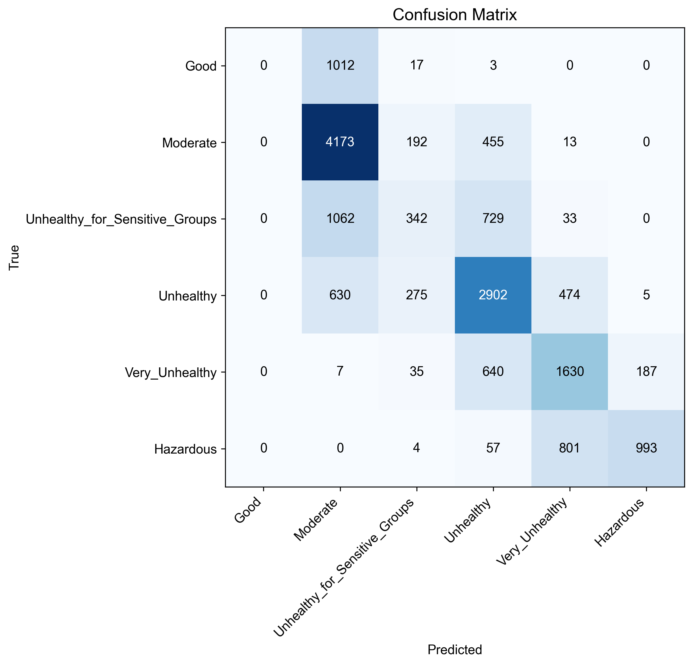

# 06 — Classification Modelling (Supervised Baseline)

## 🎯 Mục tiêu chính

Notebook này có một vai trò duy nhất và cực kỳ quan trọng: **thiết lập một "Đường cơ sở" (Baseline) về hiệu suất**.

Nó huấn luyện một mô hình học máy có giám sát (Supervised Learning) tiêu chuẩn, chỉ sử dụng phần dữ liệu nhỏ có nhãn (tương đương 5% dữ liệu train) đã được chuẩn bị ở bước 03.

Mục tiêu là để trả lời câu hỏi:
> "Nếu không dùng bất kỳ kỹ thuật bán giám sát phức tạp nào, chỉ với lượng dữ liệu có nhãn ít ỏi, thì hiệu suất tốt nhất mà một mô hình tiêu chuẩn có thể đạt được là bao nhiêu?"

Kết quả từ notebook này sẽ là **thước đo tiêu chuẩn** để so sánh và đánh giá hiệu quả thực sự của Self-Training và Co-Training.

---

## 📥 Đầu vào (Input)

| Tham số | Giá trị thực tế | Mô tả |
| :--- | :--- | :--- |
| **`FEATURES_PATH`** | `data/processed/03_features_for_classification.npz` | **Dữ liệu chính:** File chứa các ma trận features và target đã được xử lý. |
| **`CLASSIFIER`** | `hgboost` | Chỉ định mô hình sử dụng là `HistGradientBoostingClassifier`. |

---

## 📤 Đầu ra (Output)

| File | Mô tả |
| :--- | :--- |
| `data/processed/06_metrics.json` | **File quan trọng nhất:** Chứa "bảng điểm" chi tiết của mô hình, bao gồm các chỉ số hiệu suất cuối cùng. |
| `data/processed/06_classification_report.csv` | Bảng báo cáo phân loại chi tiết cho từng lớp. |
| `data/processed/06_predictions_sample.csv` | Mẫu dự đoán chi tiết trên tập Test. |
| `data/processed/06_dataset_sample.csv` | Mẫu dữ liệu đầu vào sau khi được nạp. |
| `images/06_confusion_matrix.png` | Hình ảnh trực quan hóa Ma trận nhầm lẫn. |

---

## 🔬 Phân tích kết quả thực tế: Baseline đã được thiết lập!

Dựa trên các file kết quả bạn đã chạy, đây là hiệu suất baseline của dự án.

### 1. Kết quả cuối cùng trên tập Test (`06_metrics.json`)

Đây là những con số quan trọng nhất, đóng vai trò là thước đo tiêu chuẩn.

| Chỉ số | Giá trị | Ý nghĩa |
| :--- | :--- | :--- |
| **`accuracy`** | `0.602` | Khoảng **60.2%** dự đoán của mô hình là chính xác. |
| **`f1_macro`** | **`0.472`** | **Đây là Baseline!** F1-score trung bình cho tất cả các lớp là **0.472**. |

### 2. So sánh Baseline với các phương pháp Bán giám sát

Bây giờ chúng ta có thể đặt kết quả này bên cạnh kết quả của Self-Training và Co-Training để thấy được bức tranh toàn cảnh.

| Phương pháp | f1_macro (trên Test Set) | So với Baseline | Nhận xét |
| :--- | :--- | :--- | :--- |
| **Supervised (Baseline)** | **0.472** | - | Điểm khởi đầu. |
| **Self-Training** | `0.534` | **+13.1%** | ✅ **Hiệu quả rõ rệt!** |
| **Co-Training** | `0.404` | -14.4% | 🔻 Kém hiệu quả hơn. |

> **Kết luận quan trọng:** Phân tích này cho thấy rõ ràng rằng **Self-Training là phương pháp tốt nhất** trong các thử nghiệm. Việc tận dụng 95% dữ liệu không nhãn đã giúp cải thiện hiệu suất F1-score lên tới **13.1%** so với việc chỉ dùng 5% dữ liệu có nhãn. Co-Training, trong trường hợp này, đã không mang lại hiệu quả như kỳ vọng.

### 3. Phân tích sâu hơn với Ma trận nhầm lẫn

Ma trận nhầm lẫn (`confusion_matrix`) cho chúng ta biết chính xác mô hình đang nhầm lẫn ở đâu.

**Hình ảnh trực quan hóa (`06_confusion_matrix.png`):**



**Phân tích hình ảnh và dữ liệu:**
-   **Đường chéo chính:** Các ô trên đường chéo từ trên trái xuống dưới phải thể hiện các dự đoán đúng. Ô `Moderate`-`Moderate` có màu sáng nhất (4173 trường hợp), cho thấy mô hình làm tốt nhất ở lớp này.
-   **Vùng "mù" của mô hình:** Hàng đầu tiên (Actual `Good`) gần như hoàn toàn tối màu trên đường chéo (`[0,0]` = 0), nhưng lại có một ô rất sáng ở cột `Moderate` (`[0,1]` = 1012). Điều này có nghĩa là:
    > Mô hình **hoàn toàn không thể nhận diện** được lớp `Good`. Khi thực tế là `Good`, nó đã dự đoán nhầm gần như toàn bộ thành `Moderate`.
-   **Các điểm nhầm lẫn khác:** Các ô sáng màu khác ngoài đường chéo cũng chỉ ra sự nhầm lẫn đáng kể, ví dụ như giữa `Unhealthy_for_Sensitive_Groups` với `Moderate` (1062 lần).

### 4. Minh chứng từ dữ liệu thực tế (`06_predictions_sample.csv`)

File dự đoán cho thấy cả những điểm thành công và thất bại của mô hình.
```csv
datetime,station,y_true,y_pred
2017-01-01 00:00:00,Aotizhongxin,Hazardous,Hazardous  // <-- Dự đoán đúng
2017-01-01 01:00:00,Aotizhongxin,Hazardous,Hazardous  // <-- Dự đoán đúng
2017-01-01 02:00:00,Aotizhongxin,Hazardous,Very_Unhealthy // <-- Dự đoán sai
2017-01-01 03:00:00,Aotizhongxin,Hazardous,Very_Unhealthy // <-- Dự đoán sai
```
> Điều này cho thấy mô hình có khả năng nhận diện các mức độ ô nhiễm cao, nhưng vẫn còn nhầm lẫn giữa các mức độ liền kề (`Hazardous` và `Very_Unhealthy`).

---

## 💡 Ý nghĩa trong dự án

-   **Hoàn thành mục tiêu:** Notebook này đã tạo ra một **baseline vững chắc và định lượng được (`f1_macro: 0.472`)**.
-   **Chứng minh giá trị của Self-Training:** Bằng cách so sánh với baseline, chúng ta đã **chứng minh một cách thuyết phục** rằng phương pháp Self-Training không chỉ là lý thuyết mà còn mang lại sự cải thiện hiệu suất đáng kể trên thực tế cho bài toán này.
-   **Cung cấp dữ liệu cho báo cáo:** Toàn bộ kết quả và phân tích này sẽ là nền tảng cho notebook báo cáo cuối cùng.

---

## 🔗 Notebooks liên quan

- **Trước đó:** [03_feature_preparation.md](./03_feature_preparation.md)
- **So sánh với:** [04_semi_self_training.md](./04_semi_self_training.md), [05_semi_co_training.md](./05_semi_co_training.md)
- **Tổng hợp kết quả:** [09_semi_supervised_report.md](./09_semi_supervised_report.md)
