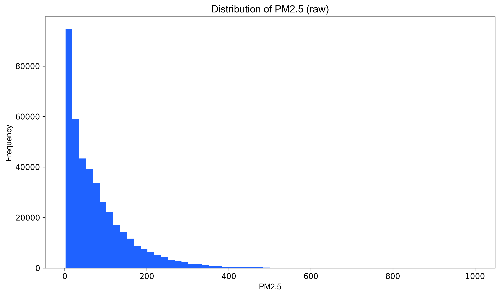

# Tài liệu: 07 - Xây dựng mô hình hồi quy (Dự báo PM2.5)

## 🎯 Mục tiêu

Notebook này chuyển hướng từ bài toán phân loại sang **hồi quy (Regression)**, với mục tiêu chính là:

> Dự đoán trực tiếp **giá trị số** của nồng độ PM2.5 trung bình 24 giờ (`pm25_24h`).

Việc này cung cấp một góc nhìn chi tiết và định lượng hơn so với việc chỉ phân loại mức độ ô nhiễm. Kết quả từ mô hình này sẽ đóng vai trò là **baseline hiệu suất cho các phương pháp dự báo dựa trên Machine Learning**, để so sánh với các phương pháp thống kê truyền thống như ARIMA.

---

## 🔬 Phân tích kết quả

### 1. Đánh giá hiệu suất qua các chỉ số

Các chỉ số trên tập kiểm tra (TEST) cho thấy khả năng dự báo của mô hình:

| Chỉ số                                  | Giá trị      | Ý nghĩa và Phân tích                                                                                                                                     |
| :-------------------------------------- | :----------- | :------------------------------------------------------------------------------------------------------------------------------------------------------- |
| **R-squared (R²)**                      | **0.783**    | **Mô hình giải thích được 78.3% sự biến thiên của nồng độ PM2.5.** Đây là một kết quả tốt, cho thấy các đặc trưng đầu vào có khả năng dự báo mạnh mẽ.       |
| **MAE (Mean Absolute Error)**           | 19.46 µg/m³  | Trung bình, dự đoán của mô hình bị chênh lệch (cao hơn hoặc thấp hơn) so với giá trị thực tế khoảng 19.46 µg/m³. Đây là sai số trung bình tuyệt đối.          |
| **RMSE (Root Mean Squared Error)**      | 30.14 µg/m³  | Chỉ số này nhạy cảm hơn với các lỗi dự báo lớn. Giá trị RMSE cao hơn MAE cho thấy mô hình có xu hướng mắc phải một số lỗi dự báo lớn ở các điểm dữ liệu cực đoan. |

### 2. Trực quan hóa kết quả dự đoán

Biểu đồ phân tán (scatter plot) là một cách hiệu quả để đánh giá hiệu suất mô hình hồi quy.

*Hình 1: Biểu đồ phân tán so sánh giá trị PM2.5 thực tế (trục hoành) và giá trị dự đoán (trục tung).*

- **Phân tích biểu đồ**:
    - Các điểm dữ liệu có xu hướng **tập trung quanh đường chéo y=x** (đường màu đỏ). Điều này cho thấy sự tương quan mạnh mẽ giữa giá trị dự đoán và giá trị thực tế, khẳng định mô hình hoạt động tốt.
    - Tuy nhiên, có thể thấy ở các giá trị PM2.5 cao (vùng ô nhiễm nặng), các điểm có xu hướng phân tán rộng hơn. Điều này cho thấy mô hình dự báo kém chính xác hơn ở các mức độ ô nhiễm cực đoan, phù hợp với việc chỉ số RMSE cao hơn MAE.

### 3. Phân phối của Biến mục tiêu

*Hình 2: Phân phối của biến mục tiêu `pm25_24h`.*

- **Phân tích**: Biểu đồ cho thấy phân phối của nồng độ PM2.5 bị lệch phải (right-skewed), với phần lớn các giá trị tập trung ở mức thấp và trung bình, và một "đuôi" dài các giá trị cao. Sự mất cân bằng này có thể là một phần nguyên nhân khiến mô hình gặp khó khăn hơn khi dự báo các giá trị ô nhiễm cực đoan, do có ít mẫu để học hỏi từ đó.

---

## 💾 Kết quả đầu ra

| Tệp                                           | Mô tả                                                                                                                  |
| :-------------------------------------------- | :--------------------------------------------------------------------------------------------------------------------- |
| `data/processed/07_regression_metrics.json`   | File JSON chứa các chỉ số hiệu suất chính của mô hình hồi quy: R², MAE, và RMSE.                                        |
| `data/processed/07_regression_predictions.csv`| Bảng dữ liệu chứa các dự đoán chi tiết trên tập kiểm tra, so sánh giá trị `y_true` và `y_pred` cho từng điểm dữ liệu.     |

---

## 💡 Kết luận và Bước tiếp theo

- Mô hình hồi quy dựa trên `HistGradientBoostingRegressor` đã cho thấy **hiệu suất dự báo tốt** với R² đạt 0.783, tạo ra một baseline vững chắc.
- Kết quả này sẽ được **so sánh trực tiếp** với hiệu suất của mô hình chuỗi thời gian ARIMA trong notebook tiếp theo (`08_arima_forecasting.ipynb`) để xác định phương pháp nào hiệu quả hơn cho bài toán dự báo giá trị PM2.5.
- Phân tích cũng chỉ ra rằng việc cải thiện khả năng dự báo ở các mức ô nhiễm cực đoan là một hướng đi tiềm năng để nâng cao hiệu suất mô hình trong tương lai.
