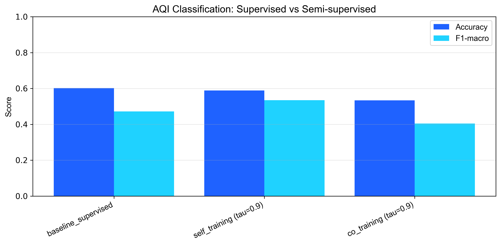
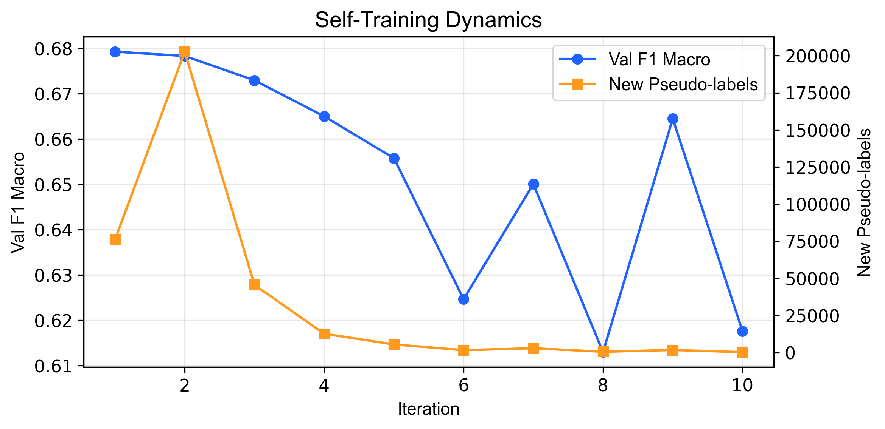
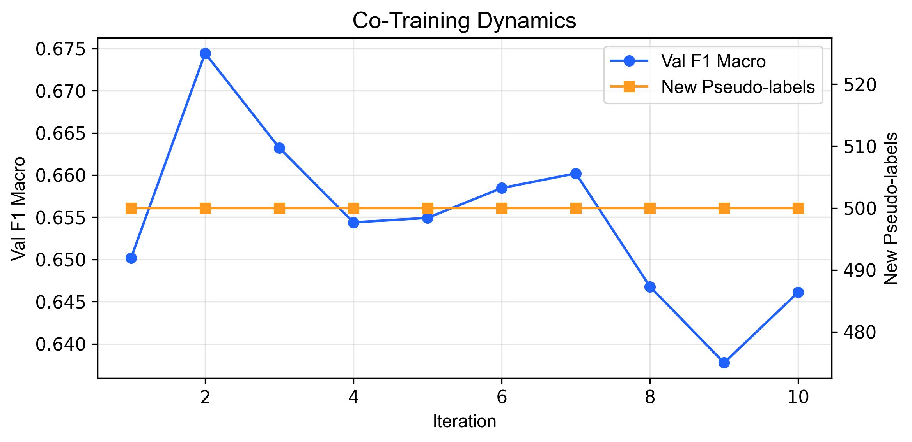

# Tài liệu: 09 - Báo cáo tổng kết về học bán giám sát

## 🎯 Mục tiêu

Đây là notebook báo cáo cuối cùng, nơi hội tụ và tổng kết toàn bộ kết quả của các thử nghiệm phân loại AQI. Mục tiêu là:

1.  **Tổng hợp và so sánh**: Tập hợp kết quả từ ba phương pháp đã thử nghiệm (Supervised Baseline, Self-Training, Co-Training) vào một nơi duy nhất.
2.  **Trực quan hóa**: Tạo ra các biểu đồ so sánh trực quan để làm nổi bật sự khác biệt về hiệu suất.
3.  **Rút ra kết luận**: Dựa trên bằng chứng dữ liệu, đưa ra câu trả lời cuối cùng cho câu hỏi nghiên cứu cốt lõi của dự án:
    > "Liệu các phương pháp học bán giám sát có thực sự cải thiện hiệu suất dự báo khi dữ liệu có nhãn khan hiếm hay không? Nếu có, phương pháp nào là tối ưu nhất?"

---

## 🔬 Phân tích so sánh toàn diện

### 1. So sánh hiệu suất tổng thể

Bảng và biểu đồ dưới đây tóm tắt hiệu suất của cả ba phương pháp trên tập kiểm tra (TEST), sử dụng chỉ số **F1-macro** làm thước đo chính do tính chất mất cân bằng của dữ liệu.

| Phương pháp               | F1-macro (Test Set) | Cải thiện so với Baseline |
| :------------------------ | :------------------ | :------------------------ |
| **Supervised (Baseline)** | 0.472               | -                         |
| **Self-Training**         | **0.534**           | **+13.1%**                |
| **Co-Training**           | 0.404               | -14.4%                    |

*Hình 1: Biểu đồ cột so sánh chỉ số F1-macro. Self-Training là phương pháp duy nhất cho thấy sự cải thiện vượt trội so với baseline.*

- **Phân tích**:
    - **Self-Training** đã chứng tỏ hiệu quả vượt trội, cải thiện hiệu suất lên tới **13.1%**. Điều này khẳng định rằng việc tận dụng dữ liệu không nhãn thông qua cơ chế gán nhãn giả đã giúp mô hình học được các ranh giới quyết định tốt hơn, đặc biệt là với các lớp khó.
    - **Co-Training**, ngược lại, cho hiệu suất thấp hơn cả baseline. Như đã phân tích ở tài liệu trước, nguyên nhân có thể đến từ việc phân chia "views" chưa tối ưu, dẫn đến việc lan truyền các nhãn giả sai lệch.

### 2. Phân tích động lực học (Dynamics)

So sánh quá trình học của Self-Training và Co-Training cho thấy sự khác biệt cơ bản trong cách chúng tiếp cận dữ liệu không nhãn.

| Self-Training Dynamics                                   | Co-Training Dynamics                                     |
| :------------------------------------------------------- | :------------------------------------------------------- |
|  |  |
| **Bùng nổ và hội tụ**: Self-Training nhanh chóng khai thác một lượng lớn nhãn giả ở các vòng lặp đầu và sau đó nhanh chóng hội tụ. | **Ổn định và thận trọng**: Co-Training học một cách từ tốn và đều đặn do bị giới hạn về số lượng nhãn giả trao đổi mỗi vòng. |

---

## 🏆 Kết luận cuối cùng

Dựa trên toàn bộ quá trình thử nghiệm và các bằng chứng đã thu thập, chúng tôi đưa ra kết luận sau:

1.  **Học bán giám sát CÓ hiệu quả**: Câu trả lời cho câu hỏi nghiên cứu là CÓ. Khi được áp dụng đúng cách, học bán giám sát có thể cải thiện đáng kể hiệu suất mô hình trong điều kiện dữ liệu có nhãn hạn chế.

2.  **Self-Training là phương pháp chiến thắng**: Trong bối cảnh của bài toán dự báo chất lượng không khí với bộ dữ liệu này, **Self-Training là phương pháp hiệu quả và ổn định nhất.** Sự đơn giản trong cơ chế hoạt động của nó lại tỏ ra mạnh mẽ, giúp mô hình cải thiện khả năng tổng quát hóa mà không đòi hỏi các giả định phức tạp về cấu trúc dữ liệu như Co-Training.

3.  **Khuyến nghị**: Đối với các bài toán tương tự có dữ liệu chuỗi thời gian được gán nhãn một phần, **Self-Training nên được xem là một trong những phương pháp tiếp cận hàng đầu** để tối ưu hóa hiệu suất mô hình.

---

## 🔗 Các tài liệu liên quan

Notebook này là điểm tổng kết cho chuỗi tài liệu về mô hình phân loại:
- [04_semi_self_training.md](./04_semi_self_training.md)
- [05_semi_co_training.md](./05_semi_co_training.md)
- [06_classification_modelling.md](./06_classification_modelling.md)
