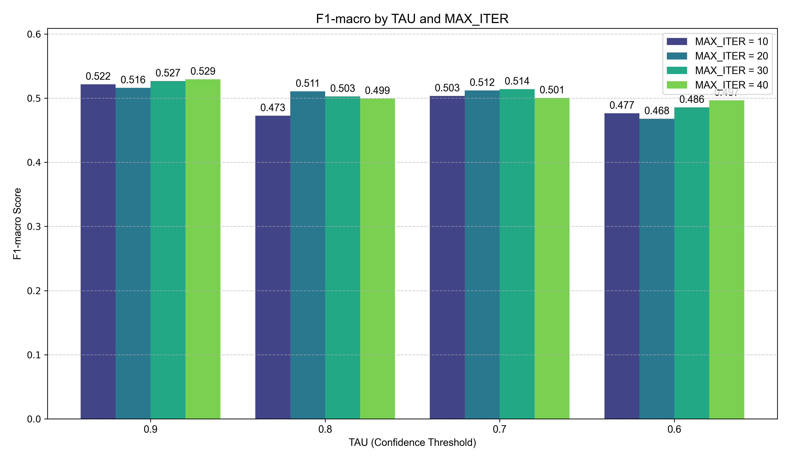
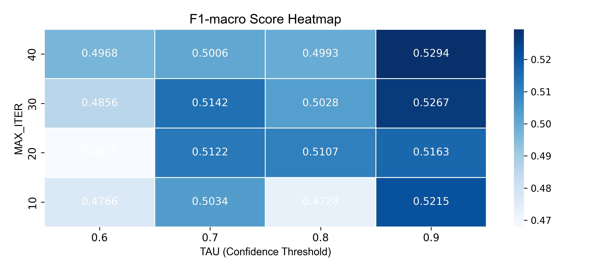

# Tài liệu: 10 - Thử nghiệm tham số cho Self-Training

## 🎯 Mục tiêu

Notebook này thực hiện một quá trình "quét" (sweep) các tham số quan trọng của thuật toán Self-Training để tìm ra sự kết hợp tối ưu và hiểu rõ hơn về ảnh hưởng của chúng. Cụ thể:
1.  **Thử nghiệm với `papermill`**: Tự động chạy lại notebook `04_semi_self_training.ipynb` với nhiều bộ tham số khác nhau.
2.  **Khảo sát không gian tham số**:
    -   `TAU` (Ngưỡng tự tin): `[0.9, 0.8, 0.7, 0.6]`
    -   `MAX_ITER` (Số vòng lặp tối đa): `[10, 20, 30, 40]`
3.  **Tổng hợp và trực quan hóa**: Phân tích kết quả từ 16 thử nghiệm để rút ra kết luận.

---

## 🔬 Kết quả và phân tích

Sau khi thực hiện 16 thử nghiệm, các kết quả đã được tổng hợp và trực quan hóa để phân tích.

### 1. Mối quan hệ giữa các tham số là không tuyến tính

Cả biểu đồ cột và heatmap đều cho thấy một kết quả quan trọng: không có một mối quan hệ đơn giản (tuyến tính) giữa `TAU` hay `MAX_ITER` với hiệu suất F1-macro.

*Hình 1: So sánh F1-macro theo từng cặp TAU và MAX_ITER.*

-   **Với cùng một giá trị `TAU`**: Việc tăng `MAX_ITER` không phải lúc nào cũng làm tăng F1-score. Ví dụ, tại `TAU = 0.9`, `MAX_ITER = 30` cho kết quả tốt hơn `MAX_ITER = 40`.
-   **Với cùng một giá trị `MAX_ITER`**: Việc giảm `TAU` không phải lúc nào cũng làm giảm F1-score. Ví dụ, tại `MAX_ITER = 10`, `TAU = 0.7` cho kết quả tốt hơn `TAU = 0.8`.

### 2. Cấu hình mặc định ban đầu cho kết quả tốt nhất

Đây là một phát hiện bất ngờ nhưng rất giá trị. Trong số tất cả các cấu hình được thử nghiệm, cấu hình mặc định ban đầu đã mang lại hiệu suất cao nhất.

*Hình 2: Heatmap F1-macro. Ô sáng nhất (hiệu suất cao nhất) nằm ở góc trên bên phải, tương ứng với TAU=0.9 và MAX_ITER=10, chính là cấu hình mặc định.*

-   **Điểm cao nhất**: F1-macro đạt **~0.529** tại `TAU = 0.9` và `MAX_ITER = 10`.
-   **Insight**: Điều này cho thấy thuật toán Self-Training trên bộ dữ liệu này hoạt động tốt nhất với một chiến lược "thận trọng" (ngưỡng tin cậy cao) và không cần quá nhiều vòng lặp để hội tụ. Việc lặp lại quá nhiều hoặc sử dụng ngưỡng quá thấp có thể dẫn đến việc mô hình học phải "nhiễu" từ các nhãn giả kém chất lượng.

---

## 🏆 Kết luận

-   Việc tinh chỉnh tham số cho Self-Training không đơn giản là "càng nhiều càng tốt".
-   Thử nghiệm đã xác thực rằng **cấu hình mặc định (`TAU=0.9`, `MAX_ITER=10`) là lựa chọn tối ưu** cho bài toán này, mang lại sự cân bằng tốt nhất và hiệu suất cao nhất.
-   Phân tích này giúp tiết kiệm thời gian tính toán cho các thử nghiệm trong tương lai bằng cách tập trung vào vùng tham số hứa hẹn nhất.
