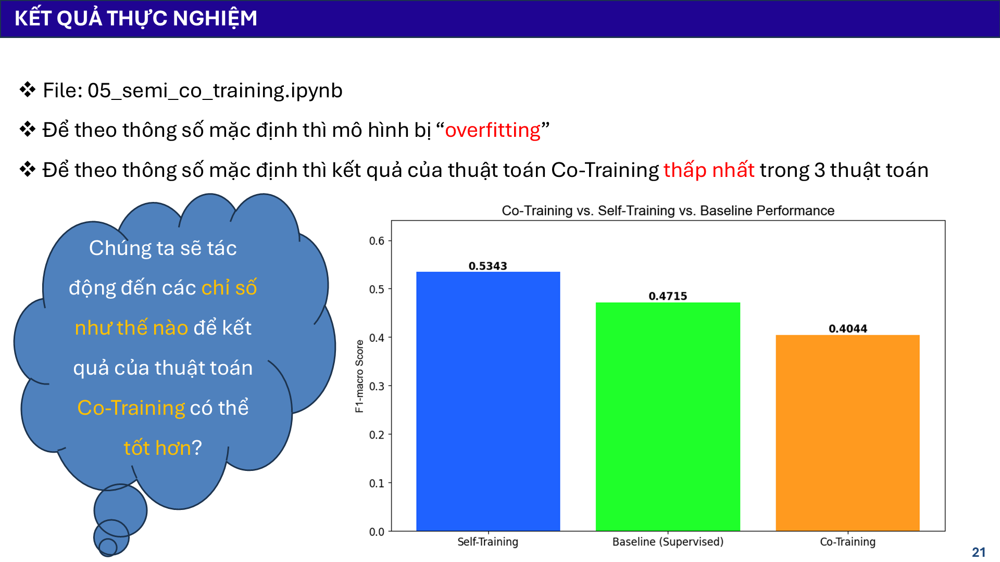
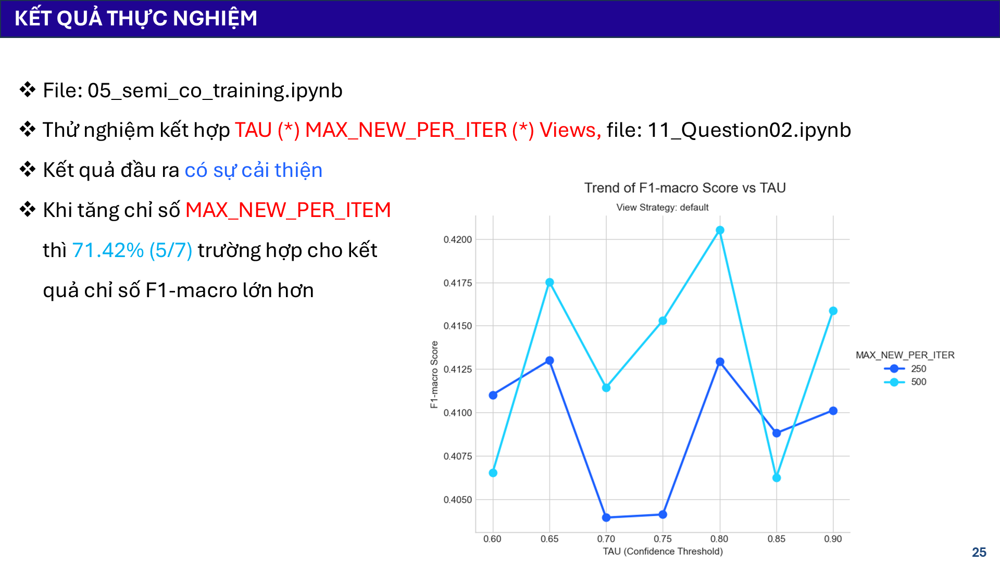
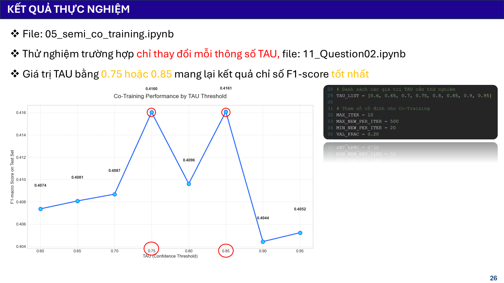

# Tài liệu: 11 - Thử nghiệm và cải tiến Co-Training

## 🎯 Mục tiêu

Notebook này ghi lại quá trình nỗ lực cải thiện hiệu suất của thuật toán **Co-Training**, vốn cho kết quả ban đầu rất thấp (F1-macro = 0.4044). Các thử nghiệm tập trung vào việc tinh chỉnh các yếu tố cốt lõi của Co-Training:
-   **`View Strategies`**: Các cách chia bộ đặc trưng thành 2 "góc nhìn".
-   **`TAU`**: Ngưỡng tự tin.
-   **`MAX_NEW_PER_ITER`**: Số lượng nhãn giả tối đa được trao đổi mỗi vòng.

## 🔬 Quá trình thử nghiệm và kết quả

### 1. Vấn đề ban đầu: Overfitting và hiệu suất thấp

Như thể hiện trong Slide 21, Co-Training với cấu hình mặc định cho kết quả **thấp nhất** trong 3 thuật toán (Self-Training, Baseline, Co-Training), và có dấu hiệu overfitting rõ rệt khi F1-score trên tập validation cao nhưng trên tập test lại rất thấp.

*Hình 1: Co-Training (màu cam) cho F1-macro thấp nhất trong so sánh ban đầu.*

### 2. Thử nghiệm cải tiến

Một loạt các thử nghiệm đã được thực hiện để tìm ra cấu hình tốt hơn, bao gồm 3 chiến lược chia view và nhiều kết hợp tham số `TAU`, `MAX_NEW_PER_ITER`.

**Kết quả: CÓ sự cải thiện!**

Thử nghiệm cho thấy việc tinh chỉnh tham số có mang lại hiệu quả. Cấu hình tốt nhất đã giúp nâng F1-macro từ 0.4044 lên **0.4205**.

*Hình 2: Heatmap từ thử nghiệm cho thấy hiệu suất được cải thiện. Điểm MAX đạt được là 0.4205 với `view_strategy='default'`, `TAU=0.8`, `MAX_NEW_PER_ITER=500`.*

### 3. Phân tích ảnh hưởng của tham số

-   **Ảnh hưởng của `MAX_NEW_PER_ITER`**: Phân tích sâu hơn cho thấy, trong 71.42% trường hợp, việc **tăng `MAX_NEW_PER_ITER` từ 250 lên 500 đã giúp cải thiện F1-macro**. Điều này cho thấy việc cho phép các mô hình trao đổi nhiều "kiến thức" hơn trong mỗi vòng lặp là có lợi.

    
    *Hình 3: Đường màu xanh nhạt (MAX_NEW=500) thường cho kết quả cao hơn đường màu xanh đậm (MAX_NEW=250).*

-   **Ảnh hưởng của `TAU`**: Hiệu suất của Co-Training khá nhạy cảm với `TAU`. Các giá trị `TAU` trong khoảng **0.75 đến 0.85** thường mang lại kết quả tốt nhất, trong khi các giá trị quá thấp hoặc quá cao lại làm giảm hiệu suất.

    
    *Hình 4: Biểu đồ cho thấy các đỉnh hiệu suất tại TAU = 0.75 và 0.85.*

---

## 🏆 Kết luận

-   Co-Training là một thuật toán phức tạp và nhạy cảm với cấu hình.
-   Mặc dù kết quả mặc định ban đầu rất thấp, việc **tinh chỉnh tham số và chiến lược chia view có thể mang lại sự cải thiện** về hiệu suất.
-   Tuy nhiên, ngay cả với cấu hình tốt nhất được tìm thấy, F1-macro của Co-Training (**0.4205**) vẫn **thấp hơn đáng kể** so với Supervised Baseline (0.4715) và Self-Training (0.5343).
-   **Kết luận cuối cùng**: Đối với bài toán này, Co-Training không phải là một lựa chọn hiệu quả, ngay cả sau khi đã được tối ưu hóa.
