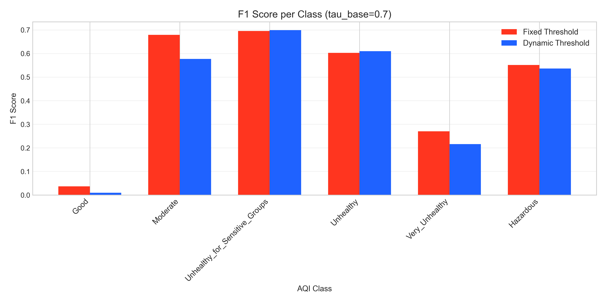

# Tài liệu: 13 - Thử nghiệm Dynamic Threshold cho Self-Training

## 🎯 Mục tiêu

Notebook này so sánh hai chiến lược gán ngưỡng trong Self-Training để giải quyết vấn đề mất cân bằng dữ liệu:
-   **Fixed Threshold**: Sử dụng một ngưỡng tin cậy `TAU` cố định cho tất cả các lớp.
-   **Dynamic Threshold**: Áp dụng một ngưỡng `TAU` động cho từng lớp, lấy cảm hứng từ phương pháp FlexMatch.

**Giả thuyết**: Dynamic Threshold sẽ giúp cải thiện khả năng dự báo các lớp hiếm (ví dụ: `Hazardous`) bằng cách hạ thấp ngưỡng cho chúng và nâng cao ngưỡng cho các lớp phổ biến.

---

## 🔬 Kết quả và Phân tích

Thử nghiệm được chạy với các ngưỡng cơ sở (`tau_base`) khác nhau. Kết quả thu được lại không như kỳ vọng ban đầu.

### 1. F1-macro tổng thể bị giảm

Trái với giả thuyết, việc áp dụng Dynamic Threshold đã **làm giảm hiệu suất F1-macro tổng thể** trên tập kiểm tra so với việc sử dụng ngưỡng cố định.

*Hình 1: Biểu đồ so sánh F1-macro. Đường màu đỏ (Fixed) luôn cho kết quả cao hơn đường màu xanh (Dynamic).*

### 2. Hiệu suất trên từng lớp cũng giảm

Phân tích sâu hơn trên từng lớp cũng cho thấy F1-score của hầu hết các lớp đều bị giảm khi áp dụng ngưỡng động.

*Hình 2: So sánh F1-score theo từng lớp (tại `tau_base=0.7`). Hầu hết các cột màu xanh đều thấp hơn các cột màu đỏ.*

---

## 🏆 Kết luận

-   **Giả thuyết không được xác nhận**: Trong khuôn khổ của thử nghiệm này, phương pháp Dynamic Threshold **không mang lại hiệu quả** như kỳ vọng. Thay vì cải thiện, nó lại làm giảm hiệu suất tổng thể của mô hình.
-   **Lý do tiềm năng**:
    -   **Độ tin cậy cao của mô hình gốc**: Mô hình `HistGradientBoostingClassifier` có xu hướng rất "tự tin" vào các dự đoán của nó. Việc hạ thấp ngưỡng cho các lớp hiếm có thể đã vô tình đưa vào tập huấn luyện các nhãn giả kém chất lượng, gây "nhiễu" và làm giảm hiệu suất.
    -   **Sự phức tạp của tương tác**: Sự tương tác giữa ngưỡng động và quá trình học của mô hình có thể phức tạp hơn giả định, dẫn đến kết quả không mong muốn.
-   **Kết luận cuối cùng**: Đối với bài toán này, chiến lược sử dụng **ngưỡng cố định (Fixed Threshold)** vẫn là lựa chọn đơn giản và hiệu quả hơn.
