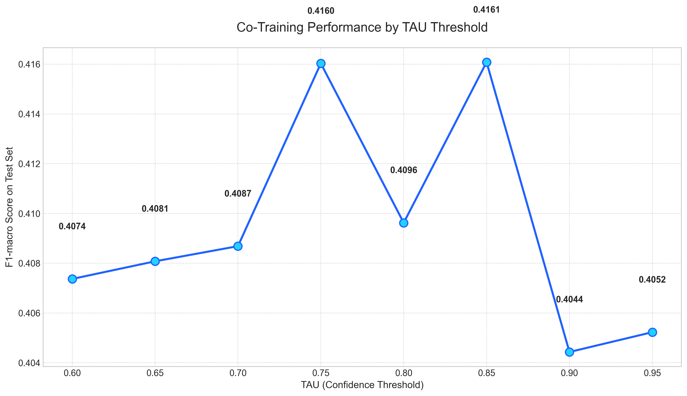

# Notebook 15: Question 05 - Co-Training Tau Parameter Sweep

## 🎯 Mục tiêu

Tối ưu hóa tham số quan trọng nhất của thuật toán Co-Training: **Ngưỡng tin cậy `TAU`**.
Khác với Self-Training, Co-Training yêu cầu sự đồng thuận hoặc độ tin cậy cao từ hai góc nhìn khác nhau. Notebook này khảo sát xem ngưỡng `TAU` nào mang lại kết quả F1-macro tốt nhất.

## ⚙️ Thiết lập thử nghiệm

### Tham số
- **`TAU_LIST`**: `[0.6, 0.65, 0.7, 0.75, 0.8, 0.85, 0.9, 0.95]`
- **`MAX_ITER`**: 10
- **`MAX_NEW_PER_ITER`**: 500
- **`RANDOM_STATE`**: 42
- **`SAMPLE_FRAC`**: 0.1 (10% dữ liệu)

### Phương pháp
1.  Lặp qua từng giá trị `TAU` trong danh sách.
2.  Chạy thuật toán Co-Training (sử dụng cấu hình mặc định cho các tham số còn lại).
3.  Ghi lại F1-macro trên tập kiểm tra (Test set).
4.  Lưu cache để tránh tính toán lại.

## 📊 Kết quả chính

### Output files
- `data/processed/15_cotraining_tau_sweep_cache.json`: Cache kết quả thử nghiệm.

### Visualizations

*Biểu đồ đường biểu diễn mối quan hệ giữa TAU và F1-macro.*

### Performance Trend
Biểu đồ cho thấy xu hướng thực tế:
- **Hiệu suất thấp toàn dải**: F1-macro dao động xung quanh mức **0.40 - 0.42**, luôn thấp hơn baseline (0.472).
- **Đỉnh nhẹ tại TAU = 0.8**: Đạt F1 ~0.42, nhưng sự cải thiện là không đáng kể so với các mức TAU khác.
- **Kết luận**: Thay đổi `TAU` không giúp Co-Training vượt qua được giới hạn cấu trúc của nó trên bộ dữ liệu này. Vấn đề cốt lõi nằm ở sự phụ thuộc giữa các Views chứ không phải ở ngưỡng tin cậy.

## 💡 Insights & Kết luận

1.  **Ngưỡng tối ưu**: Giá trị `TAU = 0.8` cho kết quả tốt nhất trong các thử nghiệm, nhưng vẫn không đủ để cạnh tranh với Supervised Baseline.
2.  **Độ nhạy thấp**: Performance không thay đổi nhiều khi thay đổi TAU, chứng tỏ mô hình không học thêm được nhiều từ dữ liệu không nhãn dù có nới lỏng hay thắt chặt ngưỡng.
3.  **Khuyến nghị**: Sự thất bại này gợi ý rằng cần tập trung cải thiện **View Design** (cách chia features) trước khi tiếp tục tinh chỉnh tham số.

## 🔗 Notebooks liên quan
- **Notebook**: `notebooks/15_Question05.ipynb`
- **Trước đó**: [11 - Co-Training Parameter Sweep](11_question02.md)
- **Tiếp theo**: [16 - Comparison of all SSL methods](16_question06.md)
