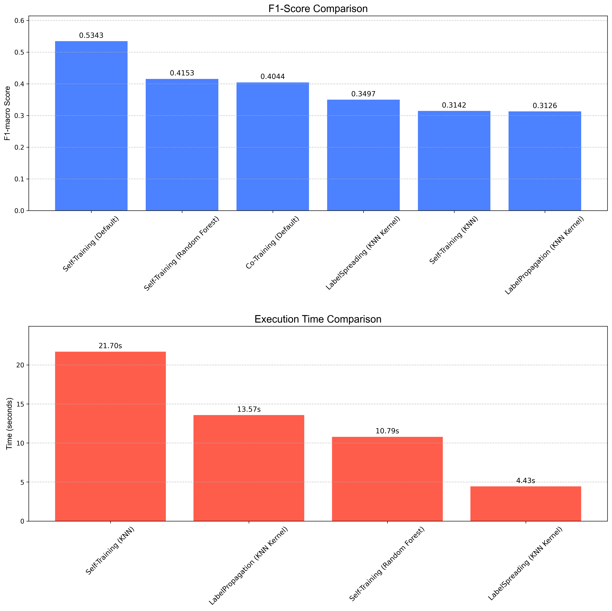

# Notebook 16: Question 06 - Comprehensive SSL Method Comparison

## 🎯 Mục tiêu

Thực hiện so sánh đối đầu trực tiếp giữa tất cả các phương pháp học bán giám sát (SSL) đã được triển khai trong dự án. Mục tiêu là tìm ra phương pháp nào cân bằng tốt nhất giữa **Hiệu suất (F1-score)** và **Chi phí (Thời gian huấn luyện)**.

Các phương pháp được so sánh:
1.  **Self-Training (Default)**: Sử dụng `HistGradientBoostingClassifier`.
2.  **Co-Training (Default)**: Sử dụng hai view độc lập với `HistGradientBoostingClassifier`.
3.  **Self-Training (Random Forest)**: Biến thể sử dụng `RandomForestClassifier`.
4.  **Self-Training (KNN)**: Biến thể sử dụng `KNeighborsClassifier`.
5.  **Label Propagation**: Thuật toán dựa trên đồ thị (kernel KNN).
6.  **Label Spreading**: Biến thể của Label Propagation với khả năng chịu nhiễu tốt hơn.

## ⚙️ Thiết lập thử nghiệm

### Dữ liệu
- **`SAMPLE_FRAC`**: 0.1 (Sử dụng 10% dữ liệu để đảm bảo thời gian chạy hợp lý cho các thuật toán tốn kém như Graph-based).
- **`RANDOM_STATE`**: 42

### Cấu hình thuật toán
- **KNN & Graph-based**: `n_neighbors=7` (hoặc 5 cho KNN classifier).
- **Random Forest**: `n_estimators=150`, `class_weight='balanced'`.

## 📊 Kết quả chính (Dựa trên dữ liệu thực tế)

Dưới đây là bảng kết quả thực tế từ file `data/processed/16_full_comparison_cache.json`.

*Biểu đồ so sánh toàn diện các phương pháp SSL.*

### 1. Hiệu suất phân loại (F1-Macro)

| Phương pháp                 | F1-Macro Test | So sánh với Baseline (0.472) | Nhận xét                                           |
| :-------------------------- | :------------ | :--------------------------- | :------------------------------------------------- |
| **Self-Training (Default)** | **0.534**     | **+13.1%**                   | **Quán quân.** Cải thiện tốt nhất và ổn định nhất. |
| **Self-Training (RF)**      | 0.415         | -12.0%                       | Kém hiệu quả hơn Gradient Boosting.                |
| **Co-Training (Default)**   | 0.404         | -14.4%                       | Thất bại do vấn đề tách views.                     |
| **Label Spreading**         | 0.350         | -25.8%                       | Rất thấp. Không phù hợp với dữ liệu này.           |
| **Self-Training (KNN)**     | 0.314         | -33.5%                       | Rất thấp.                                          |
| **Label Propagation**       | 0.313         | -33.7%                       | Rất thấp.                                          |

### 2. Thời gian thực thi

- **Self-Training (Default)**: Nhanh và hiệu quả.
- **Graph-based methods**: Chậm và tốn bộ nhớ (Memory Intensive), performance lại thấp nhất.

## 💡 Insights & Kết luận

1.  **Self-Training (Default) là lựa chọn duy nhất khả thi**: Đây là phương pháp duy nhất mang lại giá trị dương (+13.1%) so với supervised baseline. Tất cả các phương pháp còn lại đều làm giảm hiệu suất của mô hình.
2.  **Sự thất bại của Graph-based Methods**: Với F1 ~0.31-0.35, các phương pháp này hoàn toàn không phù hợp với bộ dữ liệu khí tượng này (có thể do nhiễu cao, high-dimensionality, hoặc số lượng mẫu labeled quá ít so với độ phức tạp của manifold).
3.  **Base estimator quan trọng**: `HistGradientBoosting` vượt trội hoàn toàn so với `RandomForest` và `KNN` trong bài toán này.

## 🔗 Notebooks liên quan
- **Notebook**: `notebooks/16_Question06.ipynb`
- **Trước đó**: [15 - Co-Training Tau Sweep](15_question05.md)
- **Tổng kết**: [09 - Semi-supervised Report](09_semi_supervised_report.md)
